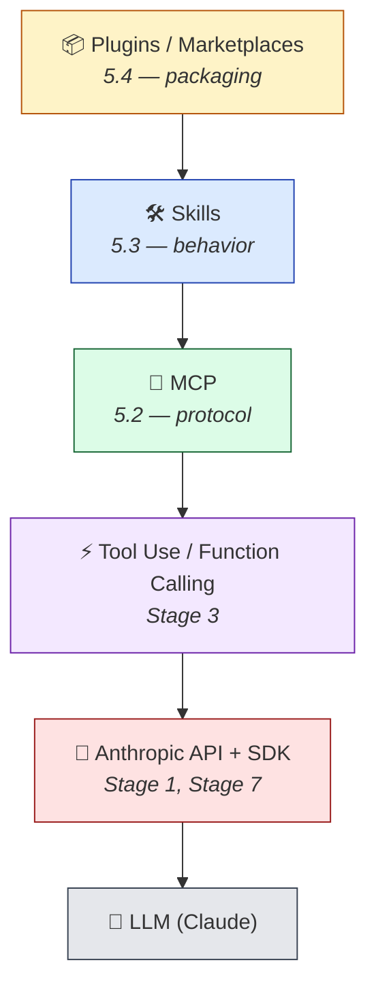

# Stage 5 — Claude Code 生態系 ⭐⭐

> [English](./05-claude-code-ecosystem.en.md) | **繁體中文**

⏱ **時間估算**：3-4 週（約 15-25 小時）

## Stack 一覽



每一層各自加上一種能力：
- **API + SDK**：用程式存取 LLM
- **Tool Use**：讓 LLM 呼叫你定義的 function
- **MCP**：標準化協定，讓任何 LLM host 都能使用任何 tool server
- **Skills**：Claude Code 的行為包，可以封裝 MCP tool
- **Plugins**：把 Skills、hooks、commands、MCP 設定打包成一個單位發佈

這個階段有 4 個子章節，**請按順序做**——每一節都建立在前一節之上。

```
5.1  Claude Code 基礎          3-5 天   （安裝、slash commands、CLAUDE.md）
5.2  MCP — 協定層              5-7 天   （寫你的第一個 MCP server）
5.3  Skills — 行為層            5-7 天   （寫你的第一個 SKILL.md）
5.4  Plugins 與 Marketplaces   5-7 天   （打包並發佈）
```

跑完這個階段，你會能擴充 Claude Code、寫自己的 MCP server、發佈一個 plugin marketplace。

---

## 5.1 — Claude Code 基礎

### 學習目標
- 在你的作業系統上安裝 Claude Code
- 使用 slash commands（`/help`、`/compact`、`/clear`、`/plan`）
- 了解 `~/.claude/` 目錄結構
- 寫一份 project 層級的 `CLAUDE.md` 來客製化行為

### 必修閱讀
1. [**Anthropic — Claude Code Quickstart**](https://docs.anthropic.com/en/docs/claude-code/quickstart) — 官方安裝指南
2. [**Anthropic — CLAUDE.md best practices**](https://docs.anthropic.com/en/docs/claude-code/memory) — 怎麼寫專案 memory
3. [**KimYx0207/Claude-Code-x-OpenClaw-Guide-Zh**](https://github.com/KimYx0207/Claude-Code-x-OpenClaw-Guide-Zh) — 簡中入門指南

### Hello-X
- **Hello Claude Code** — 安裝、跑第一個 session、請 Claude 讀檔案並摘要
- **Hello CLAUDE.md** — 寫一份專案 CLAUDE.md，觀察行為的差異

### 精選 Projects
- [**anthropics/claude-code**](https://github.com/anthropics/claude-code) — 官方 repo（issues、releases）
- [**KimYx0207/Claude-Code-x-OpenClaw-Guide-Zh**](https://github.com/KimYx0207/Claude-Code-x-OpenClaw-Guide-Zh) — 簡中導讀
- [**hesreallyhim/awesome-claude-code**](https://github.com/hesreallyhim/awesome-claude-code) — 較廣泛的資源清單（目前正在重整）

---

## 5.2 — MCP（Model Context Protocol）⭐ 基礎

### 學習目標
- 解釋 MCP 的三個抽象（Tools、Resources、Prompts）
- 把現成的 MCP server 接上 Claude Desktop 或 Claude Code
- 用 Python 寫一個最小的 MCP server，提供 1-2 個 tool
- 區分 MCP server vs Tool Use vs Skills vs Plugins

### 必修閱讀
1. [**Anthropic — Introducing MCP**](https://www.anthropic.com/news/model-context-protocol) — 最初發表，概念總覽
2. [**MCP Specification**](https://spec.modelcontextprotocol.io/) — 實際的協定規格
3. [**Complete Guide to MCP in 2026**](https://dev.to/x4nent/complete-guide-to-mcp-model-context-protocol-in-2026-architecture-implementation-and-4a11) — 實作導讀

### Hello-X
- **Hello MCP client** — 安裝 `modelcontextprotocol/servers/filesystem`，從 Claude Desktop 連上去。看著 Claude 讀你的檔案。
- **Hello MCP server** — 寫一個 Python MCP server，提供一個 tool（例如「換算溫度」）。從 Claude Code 連過去。
- **Hello MCP in production** — 在同一個 Claude session 裡同時連 2-3 個 MCP server，看它們互相搭配。

### 精選 Projects

#### [modelcontextprotocol/servers](https://github.com/modelcontextprotocol/servers) ⭐ 官方

| 欄位 | 內容 |
|---|---|
| 語言 | TypeScript / Python |
| Stars | ★ 85k+ |
| License | MIT |
| 推薦度 | ⭐⭐⭐⭐⭐ |

**教什麼**：20+ 個參考用 MCP server（filesystem、git、github、sqlite、time、fetch、memory、sequential thinking）。寫自己的 server 時最標準的範例。

**適合誰**：Hello-1 以及之後當參考用。讀 `everything` server 跟 `filesystem` server 的原始碼，理解協定怎麼運作。

**怎麼跑**：
```bash
npx -y @modelcontextprotocol/server-filesystem /path/to/dir
# 或用 Python servers：
pip install mcp-server-fetch
```

---

#### [modelcontextprotocol/python-sdk](https://github.com/modelcontextprotocol/python-sdk)

| 欄位 | 內容 |
|---|---|
| 語言 | Python |
| License | MIT |
| 推薦度 | ⭐⭐⭐⭐⭐ |

**教什麼**：寫 MCP server 的官方 Python SDK。Hello-2 用這個。

**怎麼跑**：
```bash
pip install mcp
# 然後跟著 https://github.com/modelcontextprotocol/python-sdk#quickstart 做
```

---

#### [modelcontextprotocol/typescript-sdk](https://github.com/modelcontextprotocol/typescript-sdk)

| 欄位 | 內容 |
|---|---|
| 語言 | TypeScript |
| License | MIT |
| 推薦度 | ⭐⭐⭐⭐ |

**教什麼**：Python SDK 的 TypeScript 版本。喜歡 TS 的人選這個。

---

#### [wong2/awesome-mcp-servers](https://github.com/wong2/awesome-mcp-servers) ⭐ 目錄

| 欄位 | 內容 |
|---|---|
| 形式 | 精選清單 |
| 推薦度 | ⭐⭐⭐⭐⭐ |

**教什麼**：150+ 個社群 MCP server 的目錄，按類別分類——search、code、cloud、communication、finance。

**適合誰**：在自己寫之前，先看看是不是已經有現成的。有特定 tool 需求時來逛這個。

**備註**：投稿要走他們網站（mcpservers.org）。

---

#### [punkpeye/awesome-mcp-servers](https://github.com/punkpeye/awesome-mcp-servers)

| 欄位 | 內容 |
|---|---|
| 推薦度 | ⭐⭐⭐⭐ |

**教什麼**：另一份 MCP server 目錄，組織方式不同（通常更新比較即時）。

**適合誰**：跟 wong2 的清單交叉比對。不同策展人會挖出不同的 project。

---

#### [github/github-mcp-server](https://github.com/github/github-mcp-server)

| 欄位 | 內容 |
|---|---|
| 推薦度 | ⭐⭐⭐⭐ |

**教什麼**：真正在 production 跑的 MCP server 長什麼樣子。GitHub 官方維護。

**適合誰**：把原始碼當作 production 等級 MCP server 的參考實作來讀。

---

#### [21st-dev/magic-mcp](https://github.com/21st-dev/magic-mcp)

| 欄位 | 內容 |
|---|---|
| 推薦度 | ⭐⭐⭐ |

**教什麼**：一個非平凡的 MCP server，會生成 UI 元件。讓你看到 MCP 不只能做資料抓取。

**適合誰**：做完 Hello-2 之後找靈感——MCP server 還能做出什麼有創意的東西。

---

## 5.3 — Skills（Claude Code 的行為層）

### 學習目標
- `SKILL.md` 的結構（YAML frontmatter + 本文）
- skill 何時會自動載入（description 比對）
- 怎麼寫一份能解決你日常工作的 SKILL.md
- `references/`、`scripts/`、`evals/` 子目錄的用途

### 必修閱讀
1. [**Anthropic — Claude Skills 文件**](https://docs.anthropic.com/en/docs/claude-code/skills)
2. **幾份範例 SKILL.md**——從 `anthropics/claude-code` 或社群 marketplace 拿

### Hello-X
- **Hello SKILL.md** — 寫一份 200 字的 skill，解決你日常工作中的某一件事
- **Hello SKILL with references** — 加一份 `references/` markdown 讓 skill 可以引用
- **Hello SKILL eval** — 加 `evals/evals.json`，放 3-5 個自我測試

### 精選 Projects

#### [anthropics/skills](https://github.com/anthropics/skills) ⭐ 官方 spec

| 欄位 | 內容 |
|---|---|
| Stars | ★ 128k+ |
| License | NOASSERTION |
| 推薦度 | ⭐⭐⭐⭐⭐ |

**教什麼**：Anthropic 官方的 Skills repo——`spec/`（SKILL.md frontmatter 標準）+ `template/`（起手範本）+ `skills/`（pdf、docx、xlsx、pptx、skill-creator 等 reference 實作）。

**適合誰**：寫自己的 SKILL.md 之前先讀這個——SKILL.md 結構與 frontmatter 的重要參考實作。

**備註**：跟 `anthropics/claude-code` 不一樣——這個是專門的 Skills repo，後者是 Claude Code 的主 repo。Agent Skills 的更廣義標準另見 [agentskills.io](https://agentskills.io)。

---

#### [anthropics/claude-code](https://github.com/anthropics/claude-code)

| 欄位 | 內容 |
|---|---|
| 推薦度 | ⭐⭐⭐⭐ |

**教什麼**：Claude Code 主 repo，內含 issues、releases 與一些 inline skill 範例。

**適合誰**：追蹤新版功能、回報 bug、看 release notes。

**備註**：在這個 stage（學 Skills），這個 repo 排在 `anthropics/skills`（⭐⭐⭐⭐⭐ 官方 spec）後面，所以給 ⭐⭐⭐⭐。在 branches（給 end-user 當入口）裡會看到 ⭐⭐⭐⭐⭐ 評等，是因為角色不同。

---

#### [travisvn/awesome-claude-skills](https://github.com/travisvn/awesome-claude-skills)

| 欄位 | 內容 |
|---|---|
| 推薦度 | ⭐⭐⭐⭐ |

**教什麼**：社群 Claude Skills 的精選目錄。

**適合誰**：自己寫之前先看看有沒有現成的。

---

#### [obra/superpowers](https://github.com/obra/superpowers)

| 欄位 | 內容 |
|---|---|
| 推薦度 | ⭐⭐⭐⭐ |

**教什麼**：20+ 個經過實戰檢驗的 skill（TDD、debugging、合作模式），附 `/brainstorm`、`/write-plan`、`/execute-plan` 命令以及 skills-search tool。

**適合誰**：power user 的設定。讀 SKILL.md 原始碼學進階寫法。

---

#### [VoltAgent/awesome-agent-skills](https://github.com/VoltAgent/awesome-agent-skills)

| 欄位 | 內容 |
|---|---|
| 推薦度 | ⭐⭐⭐ |

**教什麼**：1000+ 個 agent skill，相容於 Claude Code、Codex、Gemini CLI、Cursor。跨工具的視角。

**適合誰**：搞懂 SKILL.md 之後，逛逛找想法。

---

#### [alirezarezvani/claude-skills](https://github.com/alirezarezvani/claude-skills)

| 欄位 | 內容 |
|---|---|
| 推薦度 | ⭐⭐⭐ |

**教什麼**：232+ 個 Claude Code skill，跨 engineering、marketing、product、compliance。

**適合誰**：找特定領域的 skill 範例。

---

#### [mattpocock/skills](https://github.com/mattpocock/skills)

| 欄位 | 內容 |
|---|---|
| Stars | ★ 59k+ |
| License | MIT |
| 推薦度 | ⭐⭐⭐⭐ |

**教什麼**：Matt Pocock（TypeScript 社群知名教學者）公開自己工作中真實在用的 `.claude/` 目錄。每個 SKILL.md 都很短（10-50 行），不過度工程化。

**適合誰**：想看「真實工程師日常用的 SKILL.md 長什麼樣子」的人。對照那種 200 行 over-engineered 的 skill，這份是反例的好例子。

---

#### [wshobson/agents](https://github.com/wshobson/agents)

| 欄位 | 內容 |
|---|---|
| Stars | ★ 35k+ |
| License | MIT |
| 推薦度 | ⭐⭐⭐⭐ |

**教什麼**：把 skills + subagents 組合起來做 multi-agent 編排。**從單一 SKILL.md 進化到 agent-as-skill 組合 pattern** 的範例。

**適合誰**：跑過幾個 SKILL.md 之後，想知道「skill 之間怎麼互相呼叫、怎麼變成更大的 agent workflow」的中階學習者。

---

## 5.4 — Plugins 與 Marketplaces

### 學習目標
- `plugin.json` schema（name、version、skills array、configuration）
- `marketplace.json` schema（plugins array、source、metadata）
- `claude plugin marketplace add` 的流程
- 區分 single-plugin bundle vs multi-plugin marketplace
- 發佈自己的 marketplace

### 必修閱讀
1. [**Anthropic — Plugins 文件**](https://docs.anthropic.com/en/docs/claude-code/plugins)
2. **讀下面 2-3 個 marketplace 的 `plugin.json` 與 `marketplace.json`**

### Hello-X
- **Hello plugin install** — 安裝下面的某一個 marketplace，看它載入
- **Hello plugin.json** — 把 5.3 寫的 SKILL.md 打包成一個 plugin
- **Hello marketplace publish** — push 到 GitHub，用 `claude plugin marketplace add` 安裝

### 精選 Projects

#### [anthropics/claude-plugins-official](https://github.com/anthropics/claude-plugins-official) ⭐ 官方

| 欄位 | 內容 |
|---|---|
| Stars | ★ 18k+ |
| License | NOASSERTION（每個 plugin 獨立 license，請看各自目錄） |
| 推薦度 | ⭐⭐⭐⭐⭐ |

**教什麼**：Anthropic 官方的 marketplace 範本——`.claude-plugin/marketplace.json` 標準 schema、`plugins/` 內含 plugin 本體、`external_plugins/` 引用外部 repo 的 plugin。

**適合誰**：「**marketplace.json 該長什麼樣**」這個問題的權威解答。寫自己的 marketplace 之前必看。

**備註**：除了 schema 之外，也是觀察 Anthropic 怎麼分類官方 plugin（chrome-devtools、deepwiki、code-research、jam 等）的好參考。

---

#### [obra/superpowers-marketplace](https://github.com/obra/superpowers-marketplace)

| 欄位 | 內容 |
|---|---|
| Stars | ★ 900+ |
| License | MIT |
| 推薦度 | ⭐⭐⭐⭐ |

**教什麼**：**最簡 marketplace template**——repo 裡只有 `.claude-plugin/marketplace.json` + README，plugin 本體放在外部 repo。展示「**curator-only marketplace**」（策展者只負責挑選、不打包原始碼）的最小形式。

**適合誰**：要做「我策展、別人寫」型 marketplace 的人。比 anthropics/claude-plugins-official 更精簡，是最小可行範本。

---

#### [trailofbits/skills-curated](https://github.com/trailofbits/skills-curated)

| 欄位 | 內容 |
|---|---|
| Stars | ★ 388 |
| License | CC-BY-SA-4.0 |
| 推薦度 | ⭐⭐⭐ |

**教什麼**：知名資安公司 Trail of Bits 維護的 curated marketplace，重點在 **supply-chain security**——每個 skill 都經過審查，README 寫清楚審核標準。

**適合誰**：在意供應鏈信任、想學「**curator-vouches-for-safety**」這種模式的 reviewer 跟團隊。

**備註**：規模小但意義大——示範 marketplace 不只是 skill 的清單，也可以是信任機制。

---

#### [rohitg00/awesome-claude-code-toolkit](https://github.com/rohitg00/awesome-claude-code-toolkit)

| 欄位 | 內容 |
|---|---|
| 推薦度 | ⭐⭐⭐ |

**教什麼**：社群中規模最大的 Claude Code agents、skills、hooks、templates 目錄之一。涵蓋的 use case 很廣。

**適合誰**：跑完 Hello-3 之後逛逛看外面有什麼。

---

#### [anthropics/life-sciences](https://github.com/anthropics/life-sciences)（領域特化範例）

| 欄位 | 內容 |
|---|---|
| Stars | ★ 331 |
| License | NOASSERTION（marketplace 本身未提供 SPDX；裡面每個 MCP server 由各自 provider 授權） |
| 推薦度 | ⭐⭐⭐ |

**教什麼**：Anthropic 自己發的**領域特化 marketplace** 範例（針對生物 / 健康科學）——展示如何把 `marketplace.json` 為單一 vertical 量身設計，而不是塞通用清單。

**適合誰**：要做特定領域 marketplace（醫療、金融、法律、教育等）的人，可以參考 Anthropic 自己怎麼處理。

**備註**：payload 偏生科 MCP server，但 marketplace.json 結構本身才是學習重點。

---

> **「如何發佈自己的 marketplace」教學還缺**——目前最可靠的是 [Anthropic 官方 plugin 文件](https://docs.claude.com/en/docs/claude-code/plugins)。社群有寫過好的 walkthrough 部落格 / repo？歡迎開 PR 補上。

---

## ✅ 進入 Stage 6 前的自我檢查

你能不能：
- [ ] 安裝 Claude Code 並使用 5 個不同的 slash command
- [ ] 在同一個 Claude session 裡接 2 個 MCP server
- [ ] 用 Python 寫自己的 MCP server，提供 1 個能用的 tool
- [ ] 寫一份能在特定觸發詞自動載入的 `SKILL.md`
- [ ] 把 skill 打包成 plugin，再用 `marketplace.json` 發佈
- [ ] 從角色分工說出 MCP / Skills / Plugins / SDK 各自的位置

如果都可以 → 前往 [Stage 6 — Memory & RAG](06-memory-rag.md)。

## 💡 Bonus：完成這個階段之後

- 對 [`anthropics/claude-cookbooks`](https://github.com/anthropics/claude-cookbooks) 發一個 PR（小修正、文件更新）
- 把自己的 plugin 投稿到社群 marketplace
- 寫一篇文章，比較自己的 hello-MCP server 跟官方 `modelcontextprotocol/servers` 收的某一個
