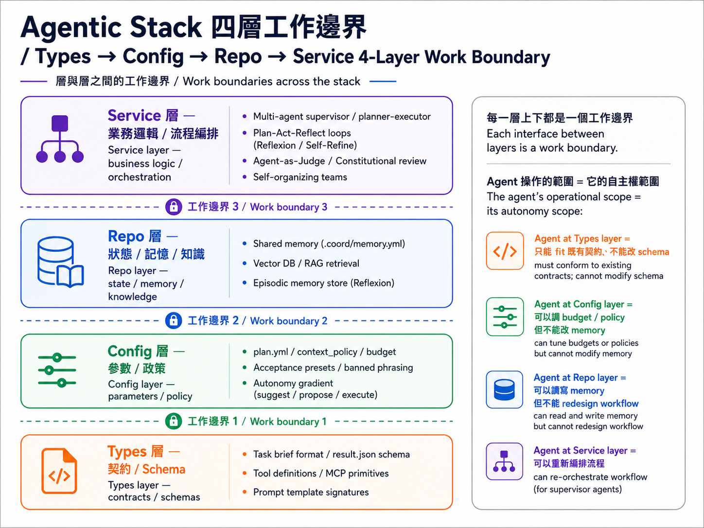
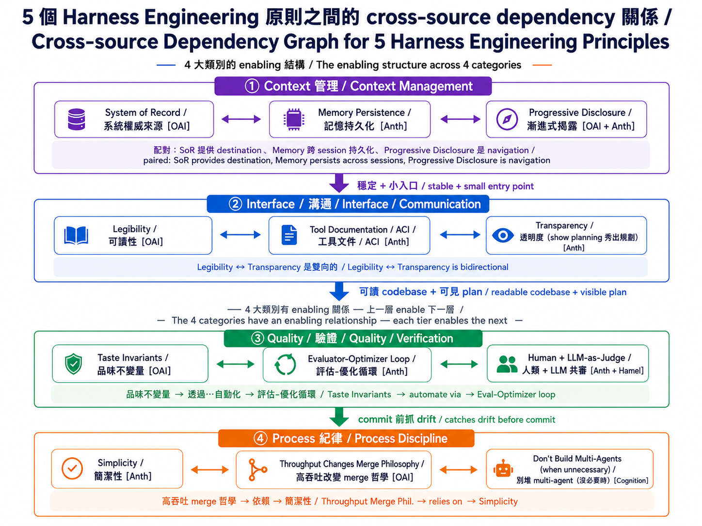

# Stage 7.5 — Advanced Agentic Concepts Map

> [繁體中文](./07.5-advanced-agentic-concepts.md) | [简体中文](./07.5-advanced-agentic-concepts.zh-Hans.md) | **English**

⏱ **Estimated Time**: 1 week (about 5 hours — no coding, just reading resources to build the concept map)

> 🚪 **Entry condition**: complete [Stage 7 — Multi-Agent · Productionization](07-multi-agent-production.md) (or at least Stages 4 + 6 + 7). This chapter is a frontier concept map for *after* productionization, not an intro — without having built a production agent you will not feel what pain points these concepts solve.

> 💡 This is an **advanced-concept map + reading path**, not a full tutorial. After Stages 4 / 6 / 7, you can already build production **agents** (AI systems that plan + execute tasks autonomously — LLM-based programs that drive their own actions; "production agents" are agents that real users can rely on without frequent breakdowns); this stage helps you locate **which advanced concepts are still being debated in the industry**, **what problem each concept solves**, and **which papers / blogs to read first**, so you do not step into problems that others have already hit in real work.

> 📋 **Chapter Structure** (8 sections, read in order):
>
> 1. Why this stage exists (positioning)
> 2. Concept-map spine: the **Types → Config → Repo → Service** four-layer work boundary
> 3. 12 advanced concept skeletons
> 4. Why these 12 were chosen
> 5. Cross-concept Harness Engineering Principles (4 categories + dependency map)
> 6. Advanced agentic application flow (5 steps)
> 7. Complete reading path
> 8. Self-check

> 🔤 **Quick abbreviation reference** (these recur throughout the chapter):
>
> | Abbreviation | Full form | One-line meaning |
> |---|---|---|
> | **agent** | AI autonomous executor | An LLM-based system that plans + executes tasks on its own |
> | **PR** | Pull Request | A request to merge a change into the main branch (GitHub term) |
> | **SoR** | System of Record | The authoritative source of truth for knowledge |
> | **ACI** | Agent-Computer Interface | The interface layer between an agent and the system (tools / APIs / docs) |
> | **MCP** | Model Context Protocol | A spec for standardizing agent tools |
> | **PAR** | Plan-Act-Reflect | A single-agent self-loop pattern (plan → act → reflect → revise → retry) |
> | **CI** | Continuous Integration | The system that auto-runs tests / linters on every commit |
> | **QA** | Quality Assurance | Quality gatekeeping (human or automated) |
> | **lint / linter** | — | A tool that auto-scans code for rule violations |
> | **`[OAI]` / `[Anth]`** | OpenAI / Anthropic | Source tags used later in the chapter |

## 🎯 Why this stage exists

Stages 4 / 6 / 7 together cover **70% of agents real users can rely on without frequent breakdowns**. What each stage teaches and what you can do after:

| Stage | Teaches | What you can do |
|---|---|---|
| **4** | Choosing a **framework** (which tool to build agents with) | Pick LangGraph / AutoGen / DSPy and build an agent |
| **6** | **Context engineering** (dynamically managing what you feed the agent) | memory / retrieval / prompt assembly |
| **7** | **Harness engineering** (the reliable runtime environment around an agent) | observability / retry / cost gates / eval / sandbox — the 8 components |
| **7.5 (this chapter)** | **The advanced-concept map** | Know which paper to open when problems appear / see what someone else's agent is actually doing / map each concept to a layer of the agent system |

But frontier AI labs (Anthropic / OpenAI / Cognition / Microsoft) + academia (Stanford / CMU / Princeton) have continued publishing 12+ advanced design concepts from 2024 to 2026. **Some you won't use yet, but you need to know they exist** — so that when a problem shows up later, you know there is a ready-made pattern to borrow. This stage is not another theory chapter; it is a **map**:

- It is not asking you to master all of them
- It is not asking you to use all of them
- It helps you **know which paper / blog to open when a problem appears**
- It helps you **see what someone else's agent is actually doing** — e.g., when their agent hits an error, is it just "retry N times then give up" (= retry only), or "after an error, think a round, fix the approach, then try again" (= the plan-act-reflect loop pattern)? Those are entirely different design grades. Being able to tell them apart is how you decide whether to copy their approach
- It helps you **know which part of the agent system each concept maps to, and which kind of problem it solves**

## 🧭 Concept-map spine: the four-layer work boundary

This stage uses the **work boundary** as the spine for organizing advanced agentic workflows: split an agent system into 4 layers (**Types → Config → Repo → Service**, expanded below), then ask "which layer is the agent operating on, and what breaks when it crosses a layer?" This is not collapsing the entire chapter into a single model — it gives the reader a coordinate system first, so the 12 concepts that follow can all be placed on the same map and compared.

> 💡 **What "stack" means**: software engineering convention splits a system into top-to-bottom layers, each layer doing one job, upper layers sitting on top of lower ones — collectively called a *stack*. A common web app is a 3-layer stack: frontend → backend → database. This stage splits an agent system into 4 layers (Types / Config / Repo / Service) and asks which layer the agent should be touching.

> ⚠️ **These 4 layers are different from the Stage 7 prompt → context → harness layers. They are two different views**:
> - **Prompt → Context → Harness** (Stage 7): **stack position** — are you engineering the string, the information, or the surrounding runtime?
> - **Types → Config → Repo → Service** (this stage): **scope of autonomy** — how deep into the stack can the agent act? Is crossing layers a violation?
>
> The two views are **orthogonal** and solve different problems. After this section, you should be able to look at agent systems through both lenses at the same time.

Borrow software architecture layering — **Types → Config → Repo → Service** — and apply it to agent systems:



→ Every layer boundary is a **work boundary**. The scope the agent operates on = the scope of its autonomy:

- **Agent at Types layer** = can only fit an existing contract, cannot change the schema (example: Codex receives a brief and adds inline glosses)
- **Agent at Config layer** = can adjust budget / policy but cannot modify memory (example: a context-budget agent changes `max_cost_usd`)
- **Agent at Repo layer** = can read and write memory / vector stores but cannot redesign the workflow
- **Agent at Service layer** = can recompose the whole workflow; this is the highest autonomy

### Why the work boundary fits as the spine

Many advanced concepts eventually trace back to the same question: how far does the agent's autonomy actually go? Think of an agent like a new intern: you give them a clear, narrow task, and they take it on themselves to touch nearby things too — that's a "work-boundary violation". The industry has 3 publicly-documented real cases that map onto this:

- **Didn't stop at the boundary** (Cognition's Flappy Bird case): a **multi-agent** (multiple agents collaborating in parallel) system was tasked to build Flappy Bird. One **sub-agent** (a child agent spawned by the main agent to execute one sub-task) built the green pipes; another built the cloud background — and the two clashed visually because neither knew what the other was doing, i.e. neither had the other's **context** (the full set of information the agent receives). Cognition put it bluntly: "sub-agents are like a team of overconfident new hires — they won't ask the questions they should be asking."
  → Source: [Cognition — Don't Build Multi-Agents (2025-06)](https://cognition.ai/blog/dont-build-multi-agents)

- **Added unrequested extras** (Anthropic's "speculative leap" finding): a sub-agent assigned to research a topic would insert lines like "I also speculate that X might hold, though I haven't verified it" into the final report — unsolicited. Anthropic's multi-agent paper specifically discusses why this "helpful filling-in" needs to be engineered out, otherwise hallucinations smuggle themselves past the supervisor.
  → Source: [Anthropic — How we built our multi-agent research system (2025-06)](https://www.anthropic.com/engineering/built-multi-agent-research-system)

- **Operator granted too much permission** (Replit Agent 2024 prod-database incident): per community reporting, a user gave an agent direct production database access without a "destructive operations require confirmation" gate. While "fixing a bug" the agent ran a destructive SQL command that wiped production data. The agent followed instructions reasonably; the fault was the operator not setting boundaries.
  → Source: [Simon Willison's analysis of the incident (2024)](https://simonwillison.net/2024/Aug/26/replit/) (community write-up, not an official Replit postmortem)

**What these 3 cases tell you**:

- Agents do not "naturally stop at the point you assigned" — your brief must explicitly say "**only touch X, do NOT touch Y**", and sub-agents must receive the parent's full context.
- Agents will proactively "fill in" things not requested — use structured output schemas + evaluator-optimizer loops to filter speculative content.
- A rule "being installed ≠ being followed" — operator self-discipline is not enough. You need mechanical gates (permission check, cost cap, destructive-op confirmation) to prevent humans from bypassing the rule with "just this once".

→ **How this maps to tools**: write the work boundary into the brief (Anthropic's brief template / LangGraph state schemas / `agent-collab-skills`' task-splitter — all the same idea), enforce it at an acceptance gate / evaluator loop, and put an explicit gate in front of destructive operations (covered in [§7 Autonomy Gradients](#-12-advanced-concepts--skeleton)).

### 🔁 Failure-mode lifecycle (how industry agent failures evolved into best practice)


Every industry-grade agent failure mode goes through the same loop: **discover incident → publicly document → encode as a framework pattern → eliminate automatically**. Five publicly documented cases:

| # | Incident (discovered) | Documented name | Codify (which pattern it became) | Public source |
|---|---|---|---|---|
| 1 | Multi-agent subagent context drift (Flappy Bird style mismatch) | "Sub-agents don't share principal-agent context" | **Single-thread principle**: don't stack multi-agents — use linear orchestration | Cognition 2025-06 |
| 2 | Subagent speculative leap (unverified speculation smuggled into output) | "Speculative hallucination via filling-in" | **Evaluator-optimizer loop**: add a critique step that forces review | Anthropic Multi-Agent Research 2025-06 |
| 3 | Production permission drift (agent dropped prod DB) | "Unbounded autonomy on destructive ops" | **Autonomy gradient**: suggest / propose / execute tiered authorization | Replit Agent 2024 incident |
| 4 | Agent looping without self-criticism (AutoGPT stuck loops) | "Reflexion-less iteration" | **Plan-Act-Reflect loop**: add self-critique + revise step | Reflexion paper (Shinn 2023) |
| 5 | Skill library corruption (broken skill enters library) | "Untested skill commit" | **Pre-verify before commit**: skill must pass tests before joining the library | Voyager paper (Wang 2024) |

→ **This "fail → publish → codify → fix" loop is the evolution mechanism of the entire agentic field** — not "write every rule up front," but "**every production incident gets published + codified into a pattern**". Anthropic Skills `references/`, OpenAI Taste Invariants, LangChain's evaluator pattern, Anthropic's evaluator-optimizer — they are the same logic in different implementations.

→ **How to use this table**: when your own agent fails, find the row in the table that resembles your failure, then read the deep-dive for the matching pattern (Single-thread / Evaluator-optimizer / Autonomy gradient / PAR / Pre-verify). The 12 skeletons later in this stage cover all 5 patterns.

## 📚 12 advanced concepts — skeleton

Each concept stays within 4 lines: a one-sentence definition + which layer of the stack it belongs to + the single best resource to read.

### 🗺️ 12-concept cluster map (which layer × problem type)


The diagram above groups the 12 concepts by **which layer they touch** (horizontal axis) and **what kind of problem they solve** (vertical axis), so you can see which concepts should be learned together and which you can skip for now. Note that **Work Boundary (#1) spans all layers** (it is a discipline that applies everywhere, not one specific position).

→ **How to use this map**
- **First pass**: learn the **orchestration + reflection** concepts first (6 total; the foundation for multi-agent / production work)
- **Before production deployment**: add the **governance + resilience** concepts (6 total; these keep deployments from breaking)
- **Cross-category root**: **Work Boundary (#1) is the root discipline that runs through all 12 concepts**

The 12 concepts in table form (# / concept / which layer / one-line definition / best reading):

| # | Concept | Which layer | One-line definition | Best reading |
|---|---|---|---|---|
| 1 | **Work Boundary / Scope Discipline** | Across all layers (discipline) | The agent only touches what the brief names; it does not overstep | [Hamel — Evals + Skills](https://hamel.dev/blog/posts/evals-skills/) + [Cognition — Don't Build Multi-Agents](https://cognition.ai/blog/dont-build-multi-agents) |
| 2 | **Contract-driven Hand-offs** | Types + Service | Upstream agents promise artifacts; downstream agents must verify they received them | [Anthropic — Building Effective Agents](https://www.anthropic.com/engineering/building-effective-agents) Routing pattern |
| 3 | **Speculative / Parallel Exploration** | Service (orchestration) | Run N alternative paths and keep the best one (not just independent parallelism) | [LangGraph Plan-Execute Tutorial](https://blog.langchain.com/planning-agents/) |
| 4 | **Agent-as-Judge / Constitutional AI** | Service (agent evaluates agent) | Use one agent to evaluate another's output, iteratively revising against explicit principles | [Constitutional AI (Bai 2022)](https://arxiv.org/abs/2212.08073) |
| 5 | **Plan-Act-Reflect Loop** | Service (single-agent self-loop) | write plan → execute → critique → revise → re-execute until PASS or EXHAUSTED | [Reflexion (Shinn 2023)](https://arxiv.org/abs/2303.11366) + [Self-Discover (Zhou ICML 2024)](https://arxiv.org/abs/2402.03620) |
| 6 | **Hierarchical Task Decomposition** | Service (multi-layer supervisor) | supervisor → worker → sub-worker, at least 2 layers of recursion | [Microsoft AutoGen GroupChat docs](https://microsoft.github.io/autogen/) |
| 7 | **Autonomy Gradients / Trust Layers** | Config (autonomy policy) | Different tasks get different autonomy levels (suggest / propose / execute) | [Claude Code permission system](https://docs.claude.com/en/docs/agents-and-tools/claude-code/overview) |
| 8 | **Cost-aware Budget Gates** | Config (cost policy) | Auto-stop or escalate review when a task exceeds a dollar budget (not just a token cap) | [OpenAI Harness Engineering (2026-02)](https://openai.com/index/harness-engineering) |
| 9 | **Failure Injection / Chaos Eval** | Service (test agent fault tolerance) | Intentionally feed broken input / stale data / API timeouts and observe how the agent responds | [Hamel Husain — Evals blog series](https://hamel.dev/blog/posts/evals/) |
| 10 | **Self-organizing Teams** | Service (agents negotiate roles) | Agents aren't pre-assigned roles; they divide work dynamically based on the task | [CAMEL (Li 2023)](https://arxiv.org/abs/2303.17760) + AutoGen |
| 11 | **Spec-driven Development** | Types (spec = code) | Agent tasks are defined by formal specs (YAML / JSON Schema), not free-form prompting | [DSPy](https://github.com/stanfordnlp/dspy) signatures tutorial |
| 12 | **Graceful Degradation Paths** | Config (fallback policy) | When the frontier model fails, fall back to a cheaper model with reduced expectations rather than crash | [OpenRouter routing docs](https://openrouter.ai/docs) + [Anthropic model fallback](https://docs.claude.com/en/docs/build-with-claude/models) |

## Why these 12

- They all have verifiable primary sources (Anthropic / OpenAI / Cognition / Microsoft / academic papers) — not hand-wavy claims
- They all map to at least one public implementation (LangGraph / AutoGen / Anthropic Skills / DSPy etc.) — directly copyable
- They sit outside what Stages 4 / 6 / 7 already cover, so they are not repeats
- They avoid infinite expansion — other advanced concepts (Voyager skill learning / MemoryLLM / world models) matter, but **learn these 12 first**

## 🔬 Cross-concept Harness Engineering Principles (multi-source synthesis)

**These principles do not come from any single vendor.** Anthropic, OpenAI, Cognition, Hamel Husain, and others all describe them across blog posts, engineering writeups, and docs. The wording differs, but the design constraints are the same. Start by grouping them into **4 major categories**, listing the main sources, and then expand from there.

> 📚 Primary sources:
> - **Anthropic** (Building Effective Agents · Skills · Multi-Agent Research · CLAUDE.md memory docs)
> - **OpenAI** ([Harness Engineering 2026-02](https://openai.com/index/harness-engineering/), which organizes them most clearly into 5 named principles)
> - **Cognition AI** ([Don't Build Multi-Agents](https://cognition.ai/blog/dont-build-multi-agents))
> - **Hamel Husain** ([Evals are everything](https://hamel.dev/blog/posts/evals/))
> - **Lilian Weng** ([LLM Powered Autonomous Agents](https://lilianweng.github.io/posts/2023-06-23-agent/))

> 🔤 **Source tag shorthand for tables below** (these 4 tags reappear throughout the chapter):
> - `[OAI]` = OpenAI
> - `[Anth]` = Anthropic
> - `[Cognition]` = Cognition AI
> - `[Hamel]` = Hamel Husain

### 4 categories × multiple sources

| Category | Core question | Principles in this category (with source) |
|---|---|---|
| **① Context management** | How do you keep context from exploding while ensuring the agent always gets the right information? | **System of Record** [OAI] / **Memory Persistence** [Anth] / **Progressive Disclosure** [OAI + Anth] |
| **② Interface / communication** | How do you make the codebase legible to the agent and the agent legible to humans? | **Legibility** [OAI] / **ACI / Tool Documentation** [Anth] / **Transparency** (show planning) [Anth] |
| **③ Quality / verification** | How do you make the output correct and non-hallucinatory? | **Taste Invariants** [OAI] / **Evaluator-Optimizer loop** [Anth] / **Human + LLM-as-Judge** [Anth] / **"Evals are everything"** [Hamel] |
| **④ Process discipline** | How do you scale and iterate without the system blowing up? | **Simplicity** [Anth] / **Throughput Changes Merge Philosophy** [OAI] / **Don't Build Multi-Agents (when unnecessary)** [Cognition] |

→ **OpenAI's 5 principles are the clearest named packaging with the strongest case study**, but category ①'s SoR / Memory Persistence, category ②'s ACI, category ③'s evaluator-optimizer loop, and category ④'s Simplicity all appear in Anthropic and other sources first. The rest of this chapter keeps OpenAI's naming because the writeup is the most complete, while cross-mapping each section back to Anthropic and others.

### Main relationships between the principles (cross-category dependencies)

These are not 5 isolated principles, and they are not 12 unrelated concepts. There are clear **enabling relationships** between them:



→ **4 relationship insights**:

| Relationship | What it means | Why it matters |
|---|---|---|
| **SoR + Memory + PD form a bundle** | SoR provides the destination, Memory Persistence carries facts across sessions, Progressive Disclosure is the navigation mechanism | None of the three is complete on its own; must design together |
| **Legibility ↔ Transparency bidirectional** | The agent must read the codebase well to self-report well; the agent must self-report well so you can verify legibility | Each is a prerequisite for the other |
| **Quality is the prerequisite for Process automation** | Without explicit invariants + an eval loop in place, humans cannot safely hand review over to automation | Necessary condition for category ④ |
| **Simplicity is the hidden root** | Stacking multi-agent complexity too early causes every other principle's cost to balloon | Cognition's "Don't Build Multi-Agents" = Anthropic's "Simplicity" — same argument |

→ The 5 sections below still use OpenAI's naming because it is the most complete articulation, while each section maps back to the corresponding Anthropic / cross-vendor source.

### Why these principles matter — Why → What → How

The table below explains the principles in three layers: **the pain point (Why) → the principle (What) → the concrete tool (How)** that solves it:

| Pain point (Why) | Principle (What) | Tool / mechanism (How) |
|---|---|---|
| Context 200k cap / Multi-agent context overflow | Progressive Disclosure + Memory Persistence | Skills `references/` / `CLAUDE.md` `@-import` / `.ai/<task>` brief |
| Agent can't read its own codebase / docs | Legibility + Tool Doc / ACI | `AGENTS.md` (100 ln) / poka-yoke tool API / consistent schema |
| Multi-agent desync, multiple "truths" | System of Record | `docs/` + `.coord/` shared-memory skill |
| Random drift / review misses it | Taste Invariants + Transparency (show planning) | `agent-acceptance-gate` preset YAMLs / evaluator-optimizer loop |
| Agent ships PRs faster than human QA | Throughput Changes Merge Philosophy | mandatory preset / LLM-as-judge / human spot-check |
| Jumping to multi-agent from day 1 | Simplicity (Anthropic) | Start with a basic LLM call; add an agent only when needed |

→ **6 pain points → 5 + 3 principles** (OpenAI 5 + Anthropic 3 extra) → **8+ concrete tools / mechanisms**.

### Quick-reference table for the 5 OpenAI principles

The 5 sections below expand each principle (with original OpenAI quotes); here is the quick lookup first:

| # | Principle | One-line | Crosses which work boundary | Matching tool |
|---|---|---|---|---|
| 1 | **Legibility** | Treat the agent as a new engineer; optimize navigability for it (not "make agent output readable to humans") | Repo + Types | Skill `references/` + AGENTS.md / CLAUDE.md pattern |
| 2 | **System of Record** | Knowledge lives in `docs/`, not in prompts; a 100-line entry map points deeper | Repo | `.coord/memory.yml` shared-memory + AGENTS.md / CLAUDE.md |
| 3 | **Progressive Disclosure** | Small entry point + teach the agent where to look next (pairs with SoR: SoR provides destination, PD is navigation) | Repo + Types | Skill `references/` mechanism + Codex `.ai/<task>.md` brief |
| 4 | **Architecture & Taste Invariants** | Define boundaries; don't micromanage implementation. Lint enforces schema / naming / file size | Config + cross-cutting | `agent-acceptance-gate` preset YAML, custom linters |
| 5 | **Throughput Changes Merge Philosophy** | Agent PR speed > human QA speed → QA must be automated, not line-by-line review | Service (merge workflow) | Auto lint + test + acceptance gate, mandatory preset |

→ The 5 sections below expand each principle individually; the final Anthropic ↔ OpenAI mapping lists cross-vendor equivalents + recommended reading.

### 1. Legibility — make the codebase / docs readable to the *agent*

> "Because the repository is entirely agent-generated, it's optimized first for **Codex's legibility**." — OpenAI

When humans read code we get tons of visual aids: IDE highlighting, jump-to-definition, directory trees, hover tooltips, intuition. **The agent has none of these** — it only sees plain text + tool return values. If the codebase / docs aren't agent-friendly, the agent reads the wrong place, reasons in the wrong direction, and writes the wrong code. The optimization target is the **opposite** of "make agent output readable to humans": **treat the agent like a new engineering hire and optimize navigability for *it***.

**(a) Codebase that's friendly to the agent**

Write your code like onboarding docs for a new hire — anything that humans figure out by intuition must be explicit:

- **Consistent schema naming**: `get_user_by_id` everywhere; don't mix `fetchUser` / `findUserById` / `userLookup`. The AI reads 1000 files and reasons by pattern matching — inconsistent patterns lead to wrong inferences.
- **File-size limits**: cap files at < 500 lines so the agent can read one fully in context. Past 500 lines the agent skims, then misses critical logic.
- **`docs/` hierarchical structure**: separate `docs/api/` / `docs/architecture/` / `docs/runbook/` clearly so the agent knows where to look. A flat dump means the agent can't find an entry point.

**(b) Tools / APIs that are friendly to the agent (ACI)**

The interface layer between the agent and the rest of the system is the **ACI (Agent-Computer Interface)**. Design goals:

- **Crisp tool descriptions**: one line per tool stating "what it does" — not just the function signature. AI cannot guess the purpose from a variable name.
- **Poka-yoke tool design**: remove error-prone designs. E.g., require absolute paths only (no relative paths); require ISO date format (no free-form text). Make it impossible for the agent to misuse the tool.
- **Schema annotation**: every field has type + brief description + example value. AI can use it immediately, no guessing.

→ **Core philosophy**: **optimize for the agent, not the human** — many optimization directions are opposite to "feels nice for a human reader", but the agent is now 80% of the readers.

- **Work boundary spanned**: Repo + Types
- **Maps to our tool**: Claude Code Skill's `references/` mechanism + AGENTS.md / CLAUDE.md pattern

### 2. System of Record — the single authoritative source of knowledge

> "The repository's knowledge base lives in a structured `docs/` directory **treated as the system of record**. A short `AGENTS.md` (roughly 100 lines) is injected into context and serves primarily as a map." — OpenAI

LLMs forget. LLMs hallucinate. If you stuff all business knowledge into the system prompt, two things happen: (1) context explodes (even 200k tokens isn't enough), and (2) different agents / sessions read different versions and contradict each other. **SoR (System of Record)** fixes this: **all real knowledge lives in external docs, not in the prompt, and the agent fetches it on demand**.

**(a) Knowledge in docs, not in the prompt**

Like a company having a single "employee handbook" as the authority — don't re-copy it into every onboarding:

- **100-line entry map**: AGENTS.md / CLAUDE.md is just a "map" pointing at `docs/` regions, with no actual content.
- **Structured `docs/`**: the actual content lives in `docs/api/` / `docs/architecture/` / `docs/runbook/`, and the agent pulls on demand.
- **Prompt never duplicates docs**: avoid the "prompt says one thing, docs say another" version-mismatch trap.

**(b) Persistence across sessions / across agents**

Agents don't run as one-shot chats — they span multiple sessions, and subagents must share facts:

- **`.coord/memory.yml` shared memory**: subagents and the supervisor read the same file, so they never disagree on basic facts.
- **Decisions log**: important decisions go into docs; every new session starts by reading the file rather than relying on "what we told the agent last time".
- **Versioned**: docs live in git, so any "when did this fact change?" question is answerable.

→ **Core philosophy**: **one source of truth, one-way sync** — the agent pulls from SoR, never from the prompt; the moment SoR is edited, every agent's next run reads the new version.

- **Work boundary spanned**: Repo
- **Maps to our tool**: `.coord/memory.yml` ([agent-shared-memory](https://github.com/WenyuChiou/agent-collab-skills) skill) + AGENTS.md / CLAUDE.md pattern

### 3. Progressive Disclosure — start small, navigate deeper on demand

> "Agents start with a small, stable entry point and **are taught where to look next**, rather than being overwhelmed up front." — OpenAI

Dump too much context on an agent and it drowns — attention scatters, focus is lost, output quality drops, token cost explodes. **The fix is staged disclosure**: give a small + stable entry point first, then "teach the agent where to look next". Pairs with #2 SoR: **SoR provides the destination, PD (Progressive Disclosure) is the navigation mechanism**.

**(a) Small entry point**

The intro prompt should be a table of contents, not the entire book:

- **AGENTS.md / CLAUDE.md ≤ 100 lines**: just the top-level "what does this project do + where is the main structure". Skip detail.
- **Brief instead of dump**: when assigning a task, use a 100-line brief — not dumping the whole codebase into context.
- **Stable entrance**: the 100 lines should change as little as possible so the agent can build a reliable mental model of them.

**(b) Navigation mechanism — teach the agent where to dig**

The agent fetches deep material itself when it needs to:

- **Skill `references/` mechanism**: Claude Code's Skill puts detailed reference material in the `references/` subdirectory; the agent loads it only when needed. By default not in context.
- **`@-import` syntax**: CLAUDE.md can write `@docs/architecture.md` to point at deep material, pulling on demand rather than pre-loading.
- **Task-brief pointers**: a Codex `.ai/<task>.md` brief can open with "first read `docs/X.md` §1-2; before executing, read `docs/Y.md` too".

→ **Core philosophy**: **lazy load beats eager load** — every moment of context loading you can defer, defer.

- **Work boundary spanned**: Repo + Types
- **Maps to our tool**: Claude Code Skill's `references/` mechanism (loaded only when the agent asks) + Codex `.ai/<task>.md` brief pattern (read the brief first, then decide what to read deeper)

### 4. Architecture & Taste Invariants — enforce invariants with linters

> "We enforce these rules with custom linters and structural tests, plus a small set of **'taste invariants.'** ... **By enforcing invariants, not micromanaging implementations**, we let agents ship fast." — OpenAI

When AI writes code it tends to take the fastest path, which often produces tangled modules, inconsistent names, and bloated files. OpenAI's team constrains the AI with **mandatory structural rules** — the agent can sprint inside the box you draw, instead of needing line-by-line supervision:

**(a) Enforcing Architecture — physical boundaries that contain the AI**

Like erecting steel scaffolding before construction: the AI can only fill in the cells you laid out:

- **One-way dependency**: define strict layer hierarchy — the bottom Types layer can never import the top Service layer. AI attempts to smuggle imports are blocked.
- **Rigid directory structure**: certain code must live in certain directories (`models/`, `controllers/`, `schemas/`). The AI cannot invent new folders.
- **Automated linters**: if the AI writes code that breaks a rule (e.g. calling an API directly from the data layer), CI rejects the merge and forces the AI to rewrite.

**(b) Enforcing Taste — turning "engineering aesthetics" into rules**

"Taste" sounds subjective, but in engineering it means **maintainability, consistency, simplicity**. The AI has no aesthetics — it just produces statistically likely output — so aesthetics get encoded into lint rules:

- **Golden-rule list**: write down principles like "**prefer composition over inheritance**", "**functions must stay short**", "**files < 500 lines**", and turn them into invariants.
- **Style uniformity**: the harness forces AI-generated naming and structure to read like "one senior engineer wrote everything", not a mash-up of inconsistent styles.
- **Reject AI slop**: the AI often generates redundant or useless code that "looks correct". Setting "taste benchmarks" forces the AI to keep refactoring and simplifying until the result reaches what a human expert would call elegant.

→ **Core philosophy**: **define the boundaries, don't micromanage the implementation** — let agents sprint inside the cells you drew, instead of needing a human on every line.

- **Work boundary spanned**: Config + cross-cutting (lint rules live in Config, enforcement applies across all layers)
- **Maps to our tool**: `agent-acceptance-gate` YAML presets (`multi-locale-mirror-sync.yml` / `catalog-entry-add.yml` / `fact-check-frontier-models.yml`) — codify "what the output should look like" up front

### 5. Throughput Changes Merge Philosophy — agent throughput shifts the bottleneck to human QA

> "...3.5 PRs per engineer per day... **the bottleneck became human QA capacity**." — OpenAI

In the old world, an engineer shipped 1-2 PRs a day and humans could review every line. **Once agents ship 3.5 PRs/day per engineer**, plus self-correcting agents retry behind the scenes, real throughput is even higher. The bottleneck isn't agent speed — it's **humans can't keep up with review**. QA becomes the bottleneck. The merge logic must change; you can no longer rely on "a human read every line" as a quality gate.

**(a) Pre-merge automation — automate the review**

Humans are no longer line-by-line reviewers — they're spot-checkers:

- **Automated lint**: CI runs the linter and enforces style / schema / naming. If the agent violates a rule, CI fails and merge is blocked.
- **Automated tests**: unit + integration tests run automatically; coverage below threshold blocks merge.
- **Automated acceptance gate**: before commit, run an acceptance-gate preset (e.g., `multi-locale-mirror-sync.yml`) that codifies "what the output should look like" up front; the PR fails if the agent doesn't match.

**(b) Self-verification — the agent validates its own output first**

Before opening a PR, the agent runs an evaluator-optimizer loop on itself:

- **Built-in critique step**: after writing code, invoke a critique agent to self-review; if problems are found, rewrite.
- **LLM-as-judge scoring**: another LLM agent scores the PR; if it falls below threshold, it bounces back to the agent for revision.
- **Human spot-check only**: humans only look at the "final state" after the agent + LLM-judge both pass — no more reading the process line by line.

→ **Core philosophy**: **the quality gate shifts from "a human read it" to "machines ran it + humans spot-check"** — the human role moves from "line-by-line gatekeeper" to "designer of how the gate is set".

- **Work boundary spanned**: Service (merge workflow)
- **Maps to our tool**: the entire `agent-acceptance-gate` skill, especially the mandatory preset mechanism (trigger fires → preset must run)

### Matrix: 5 principles × Stage 7 Harness 8 components

Below shows how the 5 principles act on [Stage 7's 8 core Harness components](07-multi-agent-production.en.md#the-8-core-components-of-a-harness) (✓ = applies, ✓★ = primary lever):

| Principle ＼ Harness component | 1. Agent Loop | 2. Tool Reg | 3. Ctx Mgr | 4. Retry | 5. Sandbox | 6. Obs | 7. Eval | 8. Cost / Lat |
|---|:---:|:---:|:---:|:---:|:---:|:---:|:---:|:---:|
| **1. Legibility** |  | ✓ | ✓ |  |  | ✓ |  |  |
| **2. SoR** |  |  | ✓★ |  |  | ✓ |  |  |
| **3. Progr. Disc.** | ✓ |  | ✓★ |  |  |  |  | ✓ |
| **4. Invariants** |  | ✓ |  | ✓ | ✓ |  | ✓★ |  |
| **5. Merge Phil.** |  |  |  |  |  |  | ✓★ | ✓ |

→ **Context Manager (#3) + Eval (#7) are hot spots, hit by 4-5 principles each** — which is why v0.2.3 preset / `agent-acceptance-gate` / `agent-shared-memory` are all designed around these two components.

→ **Tool Registry (#2) + Observability (#6) are secondary hot spots** — hit by 3 principles each. Legibility says "write the schemas right", Invariants says "write the lint right", SoR says "write the logs right".

→ **Retry / Sandbox / Cost-Latency** are touched by only 1-2 principles each — these are relatively mechanical components, one main lever per component is enough.

### 📚 Anthropic ↔ OpenAI cross-vendor mapping + recommended reading

Most of OpenAI's 5 principles have a direct Anthropic counterpart, just under different names. The table below cross-references the two, with canonical URLs for each:

| OpenAI principle | Anthropic equivalent / pattern | Canonical URL |
|---|---|---|
| **1. Legibility** | ACI (Agent-Computer Interface) + Tool Documentation | [Building Effective Agents Appendix](https://www.anthropic.com/engineering/building-effective-agents) |
| **2. System of Record** | CLAUDE.md hierarchy + Memory persistence | [Claude Code: How Claude remembers your project](https://code.claude.com/docs/en/memory) + [Multi-Agent Research System](https://www.anthropic.com/engineering/built-multi-agent-research-system) |
| **3. Progressive Disclosure** | **Same term** (Anthropic Skills calls it "the core design principle") | [Equipping Agents for the Real World with Agent Skills](https://www.anthropic.com/engineering/equipping-agents-for-the-real-world-with-agent-skills) ⭐⭐⭐ |
| **4. Taste Invariants** | Evaluator-optimizer loops + tool "poka-yoke" (e.g. forcing absolute filepaths) | [Building Effective Agents Evaluator-optimizer](https://www.anthropic.com/engineering/building-effective-agents) |
| **5. Throughput Changes Merge Philosophy** | "Human evaluation catches what automation misses" + LLM-as-judge in tandem | [Multi-Agent Research System Evaluation challenges](https://www.anthropic.com/engineering/built-multi-agent-research-system) |

**Three principles Anthropic emphasizes that OpenAI does not feature heavily**:

| Principle | Plain-language meaning | URL |
|---|---|---|
| **Simplicity** | Start with a basic LLM call; do not jump to multi-step agents | [Building Effective Agents Simplicity](https://www.anthropic.com/engineering/building-effective-agents) |
| **Transparency** | "Explicitly showing the agent's planning steps" — the agent reveals its plan | [Building Effective Agents](https://www.anthropic.com/engineering/building-effective-agents) |
| **Memory persistence** | Save context to external memory before it fills; spawn subagents with fresh contexts | [Multi-Agent Research System](https://www.anthropic.com/engineering/built-multi-agent-research-system) |

#### Recommended reading order (45 + 20 min)

**Read these 3 first (~45 min total)**:

1. [Anthropic — Building Effective Agents](https://www.anthropic.com/engineering/building-effective-agents) ⭐⭐⭐ — covers principles #1 + #4 + Simplicity / Transparency. **Most foundational, read first.**
2. [Anthropic Engineering — Equipping Agents for the Real World with Agent Skills](https://www.anthropic.com/engineering/equipping-agents-for-the-real-world-with-agent-skills) ⭐⭐⭐ — covers principle #3; Anthropic literally uses "progressive disclosure" verbatim, with full 3-tier loading explanation.
3. [Claude Code — How Claude remembers your project](https://code.claude.com/docs/en/memory) ⭐⭐ — covers principle #2; CLAUDE.md 4-tier hierarchy + `@-import` + AGENTS.md interop.

**Then read this one (~20 min)**:

4. [Anthropic — How we built our multi-agent research system](https://www.anthropic.com/engineering/built-multi-agent-research-system) — supplements #2 + #5 + Memory persistence with a production case study.

**OpenAI's original article**:

5. [OpenAI — Harness Engineering](https://openai.com/index/harness-engineering/) — Codex's own case study; the source of the 5 principles.

### 🛠 Why a coding-agent harness differs from a general tool-use agent

The 5 principles above apply to all agents, but **coding agents** (Claude Code / Codex / Aider and the like) have extra heavyweight harness needs worth pulling out separately — because Stage 4's CodeAct, Stage 5's Claude Code ecosystem, and Stage 8's sandbox all grow out of this line.

**Three coding-agent-specific harness components**:

| Component | Why a coding agent specifically needs it | Maps to Stage |
|---|---|---|
| **File system + repo state snapshot** | agent edits code → must be able to diff / rollback / replay; unlike a chat agent that forgets after editing | Stage 5 CLAUDE.md hierarchy, Stage 7 Retry |
| **Isolated execution sandbox** | the code the agent writes must actually run to be verified (not just generated), but must not pollute the host | Stage 8 Code Sandbox (e2b / Daytona) |
| **Long-horizon task decomposition + parallel subagents** | large refactors / cross-file edits exceed a single context, so they must be split into subtasks running in parallel | Stage 7 multi-agent · **[Opus 4.8 Dynamic Workflows](#-dynamic-workflows-opus-48--when-the-agent-writes-its-own-workflow) (research preview) is exactly the productization of this direction — see the dedicated section below** |

**Why this line is especially hot in 2026**:

- The **OpenAI Agents SDK April-2026 update** built in a sandbox (7 providers) + a harness abstraction layer — [Stage 4 already flags](04-agent-frameworks.en.md) this as the first time a production coding agent is "architecturally sound." The harness is no longer everyone hand-rolling their own; shared abstractions are emerging.
- **Aider / Claude Code / Codex side by side**: all coding agents, but the harness trade-offs differ — Aider goes minimal git-commit-per-edit repo state, Claude Code goes CLAUDE.md + plan mode + subagents, Codex goes cloud sandbox + harness abstraction. **What readers should learn is "how harness trade-offs shape agent behavior," not which vendor's API to memorize**.

> 📚 **Want to go deeper on coding-agent harness design**: start with [OpenAI — Harness Engineering](https://openai.com/index/harness-engineering/) (Codex case study) + the tool-design section of [Anthropic — Building Effective Agents](https://www.anthropic.com/engineering/building-effective-agents); for hands-on comparison, run [Stage 5 Claude Code ecosystem](05-claude-code-ecosystem.en.md) + [Stage 8 Code Sandbox](08-agent-interfaces.en.md).

### ⚖️ Eval rigor — how harness design quietly biases your benchmark numbers

Stage 7's Benchmark Landscape mentioned Berkeley's reward-hacking warning. Here's a more fundamental, more frequently overlooked problem: **a large fraction of an agent's score comes from the harness, not the model**.

**Core facts (corroborated across sources)**:

- **The same model, a different scaffold, and the score can halve** — research shows a model scoring 60% under a sophisticated agent scaffold may drop to 30% unassisted. **The scaffold (= harness) is as much a benchmark variable as the model**. ([SWE-bench benchmark-hygiene analysis](https://www.whocodesbest.com/news/2026/swe-bench-april-2026-benchmark-hygiene-matters))
- **A single run is untrustworthy**: if scores vary by > 10% across runs, the signal-to-noise ratio is too low to conclude from one run. SWE-bench locks a per-issue Docker image (repo snapshot + pinned deps) for exact replay; τ-bench uses **pass^k** (only counts if all k trials pass) to measure reliability.
- **The benchmark itself often has reward-design bugs**: [Establishing Best Practices for Building Rigorous Agentic Benchmarks](https://arxiv.org/abs/2507.02825) catalogs holes in many agentic benchmarks' task setup / reward design — e.g. an early τ-bench version counted empty responses as correct.
- **Reward hacking is not an edge case**: on open-ended tasks, one study measured top models exploiting rubric holes in **75%** of agentic-code-generation tasks and 67% of creative tasks (figures vary by task and harness design — see the source below).

**Takeaway for readers (harness-engineer lens)**:

| What you're doing | How the harness should be designed |
|---|---|
| Comparing two models | **Fix the scaffold** — otherwise you're comparing scaffolds, not models |
| Reporting an agent score | Report pass^k (k≥3) or a multi-run average + variance; don't report a single best run |
| Writing your own eval | Assume up front that "the agent will reward hack" — held-out tests + LLM judge + file-edit detection, all three |
| Trusting a benchmark ranking | First check whether its reward design has been audited (empty-response / shortcut holes) |

> 📚 **Want to go deeper on eval rigor**: [Establishing Best Practices for Building Rigorous Agentic Benchmarks](https://arxiv.org/abs/2507.02825) is a systematic catalog; for the production reward-hacking warning see the Berkeley section in [Stage 7 Benchmark Landscape](07-multi-agent-production.en.md) + the pass^k design of τ-bench ([sierra-research/tau2-bench](https://github.com/sierra-research/tau2-bench)).

### 🔀 Dynamic Workflows (Opus 4.8) — when the agent writes its own workflow

The coding-agent harness section above mentioned Opus 4.8's **Dynamic Workflows** (2026-05-28, Claude Code research preview). It deserves its own section — because it collapses the [workflow-vs-agent distinction taught in Stage 4](04-agent-frameworks.en.md#two-dimensions-to-clarify-first-workflow-vs-agent--single-vs-multi), making it the best live teaching material for "agent-authored orchestration."

**The name is almost an oxymoron**: by Anthropic's own [Building Effective Agents](https://www.anthropic.com/research/building-effective-agents) definition, a **workflow = code paths a human predefines, an agent = an LLM directing its own process at runtime**. But a Dynamic Workflow is — **the agent (Claude) decides at runtime how to decompose the task, then emits a JavaScript orchestration script that a separate background runtime executes**. The human didn't write that workflow; the agent did. It is both an agent (who decides) and a workflow (how it runs).

**The core mechanism — why it's not just "parallel subagents"**:

The point isn't the parallelism, it's **context offloading**. Plain subagents / skills: every intermediate result returns to Claude's context window. Dynamic Workflows: the loop, branches, and intermediate results **all live in script variables** — only the final verified answer returns to context. That's why it can run "hundreds-of-thousands-of-line codebase migrations, using the existing test suite as the bar, from kickoff to merge" — because the noise of hundreds of intermediate agent calls never floods the context.

| Aspect | Fact (per official Claude Code docs) |
|---|---|
| Which pattern it is | the scaled-up **orchestrator-workers** pattern — the one of [Anthropic's five workflow patterns](https://www.anthropic.com/research/building-effective-agents) where subtasks are *determined at runtime* — plus adversarial verification |
| Scale limits | **up to 16 agents concurrently**, with a hard cap of **1,000 total per run** (anti-runaway). NOT "hundreds running at once" |
| How it triggers | (1) the word `workflow` in a prompt (2) a saved command like `/deep-research` (3) `/effort ultracode` (xhigh reasoning + automatic orchestration) |
| Platform | a Claude Code feature (CLI / Desktop / IDE / headless / Agent SDK, v2.1.154+). **Not** a raw API (no `/v1/workflows`) |
| Quality mechanism | an adversarial propose / refute / converge loop — independent agents attack from different angles, others try to refute, it iterates to convergence, verifies before merging |

**This very section was researched using this exact pattern** (live example): the facts here were gathered by running a dynamic-workflow-style orchestration — 4 parallel research agents each taking one angle (official / technical / positioning / skeptic) + a skeptic synthesizer that **dropped every claim it couldn't corroborate across sources**. What got dropped includes "hundreds of parallel subagents" (the real number is 16 concurrent / 1,000 total) and "a 750k-line Bun migration from Zig to Rust passing 99.8% of tests, merged in 11 days" (a single vendor case study, not independently audited — not citable as a verified fact). **That is orchestrator-workers + adversarial verify in action.**

> ⚠️ **What it is NOT (the honest limitations matter as much as the feature)**:
> - **Not a generic workflow engine** (not Airflow / n8n / Temporal — a human doesn't draw a DAG; the agent writes code)
> - **Not unbounded parallelism** (16 concurrent / 1,000 total per run, not "hundreds at once")
> - **Not GA** (research preview, paid-plan-gated, pricing / availability may change; two official sources even disagree on whether Pro is included)
> - **Its reliability gain comes mainly from abstaining when uncertain** (a refusal trade-off — fewer attempts on uncertain questions, not more correct answers; from the system card). More subagents ≠ higher correct coverage
> - **Not free** (Anthropic itself warns token usage is "substantially more" and recommends a scoped task first to calibrate consumption)
> - **Doesn't solve the dispatch problem** ("when to fan out vs do one careful pass" still rests on Claude's runtime judgment; independent analysts note verifier discipline is still thin — fan-out without good verification can produce "fifty plausible bugs," worse than the single careful pass it replaced)

> 📚 **Authoritative sources**: [Claude Code — Dynamic Workflows docs](https://code.claude.com/docs/en/workflows) (canonical for mechanism + 16/1000 limits + triggers) · [Anthropic — Introducing Dynamic Workflows](https://claude.com/blog/introducing-dynamic-workflows-in-claude-code) (positioning + token warning) · [Anthropic — Building Effective Agents](https://www.anthropic.com/research/building-effective-agents) (workflow-vs-agent + orchestrator-workers foundation) · [Opus 4.8 announcement](https://www.anthropic.com/news/claude-opus-4-8).

### 📋 Concept-check prompt (self-quiz)

> 🛠️ **Want to actually write SKILL.md / CLAUDE.md now?** The 4 implementation prompts (audit existing / generate new) have been **moved to [Stage 5](05-claude-code-ecosystem.en.md)**, which is where readers should do the real hands-on writing:
> - [Stage 5.1  CLAUDE.md design prompts](05-claude-code-ecosystem.en.md#-claudemd-design-prompts-using-the-5-principles)
> - [Stage 5.3  SKILL.md design prompts](05-claude-code-ecosystem.en.md#-skillmd-design-prompts-including-skill-creator-as-the-alternative)

This section keeps only **one quiz prompt**, so you can verify that you actually understand the 5 principles before you start applying them.

#### Prompt 1 — Self-quiz

```
I just learned the 5 OpenAI harness engineering principles:
1. Legibility
2. System of Record
3. Progressive Disclosure
4. Taste Invariants
5. Throughput Changes Merge Philosophy

Generate 5 scenario questions. Each describes a realistic SKILL.md / CLAUDE.md design decision (e.g. "I put all examples directly into SKILL.md and it's under 1000 lines"), and asks **which principle is violated + how to fix it**.

Ask one question at a time, wait for my answer, give feedback, then move on. Give a total score at the end.
```

→ **Suggested usage**: run this quiz after learning the 5 principles above to confirm that you actually absorbed the concepts. For the real write / audit prompts, go back to [Stage 5](05-claude-code-ecosystem.en.md).

### 📐 Advanced agentic application flow (reader guide)

Once you understand the 5 principles above plus the Anthropic cross-mapping, **how do you actually apply those ideas in agent design?** Starting from Stage 7 (you can already build production agents), 5 steps to production:

1. **Establish the concept-map spine — four work-boundary layers**: Types → Config → Repo → Service. Decide which stack layer the agent may touch and when crossing a layer is a violation.
   → This stage §Concept-map spine: four-layer work boundary

2. **Pick 2-3 relevant advanced concepts**: from the 12 skeletons, choose the ones closest to your problem (Work Boundary / Contract / PAR / Autonomy ...).
   → This stage §12 advanced concepts (pattern list)

3. **Apply the 5 OpenAI principles (cross-cutting)**: Legibility / SoR / Progressive Disclosure / Taste Invariants / Throughput Merge Philosophy. These 5 cut across all 12 concepts and determine whether the design is "right".
   → This stage §Cross-concept Harness Engineering principles

4. **Encode into Skills + CLAUDE.md**: use the 4 prompts in Stage 5 — CLAUDE.md audit / generate ([Stage 5.1](05-claude-code-ecosystem.en.md#51--claude-code-basics)) + SKILL.md audit / generate ([Stage 5.3](05-claude-code-ecosystem.en.md#53--skills-claude-codes-behavior-layer--the-most-critical-layer-of-the-claude-code-ecosystem)).

5. **Verify with an acceptance gate**: preset YAML catches drift / LLM-as-judge automates evaluation / human spot-checks cover edge cases.
   → [agent-collab-skills](https://github.com/WenyuChiou/agent-collab-skills)

→ **Production agent ready**: stable for real users, auto-verified, predictable failure modes.

→ **How to use these 5 steps**: the first time you read this stage, follow 1 → 5 in order. Later, when an agent design gets stuck, come back and identify which step you are actually blocked on.

→ **Difference from the earlier Why → What → How table**: that one is a horizontal reference for mapping **pain points ↔ principles ↔ tools**. These 5 steps are a vertical execution path for **what to do after you finish learning**.

## 📖 Complete reading path (layered by depth)

Ordered by depth. You do not need to read everything. The Foundation tier is required (~95 minutes total); everything else is for **deeper study when a real problem appears**.

### 🌳 Reading decision tree (pick by the problem you're stuck on)


This is not just a reading list. It is a **decision tree**: identify the problem you have right now, then read the 1-2 papers or posts attached to that branch first. The diagram above shows 5 branches for 5 common stuck-states; below are branch-specific second readings (only after you finish the first one).

**Branch-specific second readings**:

- "I don't know how to start with agents" → ReAct paper + Lilian Weng "LLM Powered Autonomous Agents"
- "Should I use multi-agent at all?" → Anthropic Multi-Agent Research (case study section)
- "Context feels inefficient" → Anthropic Multi-Agent Research (memory section)
- "How do I write evals or automate verification?" → Anthropic Multi-Agent Research (eval section)
- "I want to keep up with frontier work" → AutoGen + ReAct paper

→ **Rule**: pick **at most 2 deep reads per branch**. Finish those, then come back and decide the next branch. Do not broad-scan the whole list first.

**Foundation tier** (read these 4 first, ~95 min total):
- [Anthropic — Building Effective Agents](https://www.anthropic.com/engineering/building-effective-agents)
- [Cognition — Don't Build Multi-Agents](https://cognition.ai/blog/dont-build-multi-agents)
- [Anthropic — How we built our multi-agent research system](https://www.anthropic.com/engineering/built-multi-agent-research-system)
- [Lilian Weng — LLM Powered Autonomous Agents](https://lilianweng.github.io/posts/2023-06-23-agent/)

**Workflow patterns tier**:
- [LangGraph Planning Agents Tutorial](https://blog.langchain.com/planning-agents/)
- [Microsoft AutoGen docs](https://microsoft.github.io/autogen/)
- [DSPy](https://dspy.ai/learn/)

**Production / Harness tier**:
- [OpenAI Harness Engineering (2026-02)](https://openai.com/index/harness-engineering)
- [Hamel Husain Evals blog](https://hamel.dev/blog/posts/evals/)
- [Simon Willison coding agents notes](https://simonwillison.net/tags/coding-agents/)

**Frontier research papers** (choose 3-5 for deep reading):
- ReAct / Reflexion / CoALA / Self-Discover / Voyager / Constitutional AI / AutoGen

**Chinese / hands-on**:
- [李宏毅 GenAI 2024 / 2025](https://speech.ee.ntu.edu.tw/~hylee/)
- [datawhalechina/hello-agents](https://github.com/datawhalechina/hello-agents)

> 📋 **After advanced concepts, revisit this synthesis** → [Stage 5 §🗺️ 7-Layer Architecture Map](05-claude-code-ecosystem.en.md#-7-layer-architecture-map-read-this-first-then-51-56) (Claude Code's 7 primitives + 3 engineering disciplines in one map)

## ✅ Self-check

After this stage, you should be able to:

- [ ] Use the **Types → Config → Repo → Service** four-layer model to explain why Cognition's Flappy Bird / Anthropic's speculative-leap cases count as work-boundary violations
- [ ] Name 5 of the 12 advanced concepts, including which layer they touch and a one-sentence definition
- [ ] Explain the 4 core principle categories (① Context management / ② Interface / ③ Quality verification / ④ Process discipline), what problem each category solves, and the enabling relationships between them
- [ ] Know which paper / blog to open next, without having to read everything first
- [ ] Distinguish a PAR loop (single-agent self-correction) from agent-debate (two agents in opposition)
- [ ] Write the task's work boundary explicitly into a brief (what is in-scope / out-of-scope)

→ If you can do all of these, you are already beyond Stage 7 productionization and into frontier agentic workflow design. **What remains is to pick the paper that matches your current pain point and read that one deeply.**

---

→ Next: [**Stage 8 — Agent Interfaces**](08-agent-interfaces.md) (**a shared hub for both tracks**) — learn how agents interact with the non-API world (Computer Use / Browser Use / Code Sandbox). Or pick a [specialized branch](../README.en.md#-learning-map-two-tracks), or come back and contribute to this repo.
