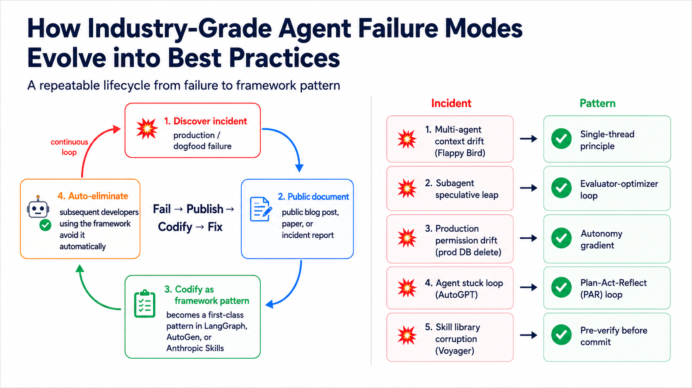

# Stage 7.5 — Advanced Agentic Workflow Concepts (Advanced Agentic Concepts, skeleton + reading list)

> [Traditional Chinese](./07.5-advanced-agentic-concepts.md) | [简体中文](./07.5-advanced-agentic-concepts.zh-Hans.md) | **English**

⏱ **Estimated Time**: 1 week (about 5 hours — no coding, just reading resources to map out the advanced concepts)

> 💡 This is a **map + reading list**, not a full tutorial. After Stages 4 / 6 / 7, you can already build production agents; this stage tells you **which frontier concepts still exist** and **which papers / blogs to read**, so you do not step into problems that others have already hit in real work.

> 📋 **Chapter Composition**: Why this stage exists → **First advanced concept: the Types → Config → Repo → Service four-layer work boundary** (diagram) → 12 advanced concept skeletons → Why these 12 were chosen → **Core Harness Engineering Principles (multi-source, 4 categories + dependency map)** → Advanced agentic application flow (5 steps) → Complete reading path → Self-check

## 🎯 Why this stage exists

Stage 4 teaches you how to choose frameworks, Stage 6 teaches context engineering, and Stage 7 teaches harness + productionization. Together, those three stages are enough for **70% of production agents**.

But frontier labs (Anthropic / OpenAI / Cognition / Microsoft) and academia (Stanford / CMU / Princeton) introduced 12+ advanced concepts across 2024-2026. **Some of them are worth knowing exist even if you do not need them yet.** This stage is the map for those concepts:

- It is not asking you to master all of them
- It is not asking you to use all of them
- It helps you **know which paper / blog to open when a problem appears**
- It helps you **say "this system is doing a plan-act-reflect loop" instead of only saying "it retries" when you evaluate someone else's agent**

## 🧭 First advanced concept: the four-layer work boundary

The first advanced concept worth learning for production-grade agentic workflows is the **work boundary** — which layer of the stack does the agent operate on, and what breaks when it crosses layers?

> ⚠️ **These 4 layers are different from the Stage 7 prompt → context → harness layers. They are two different views**:
> - **Prompt → Context → Harness** (Stage 7): **stack position** — are you engineering the string, the information, or the surrounding runtime?
> - **Types → Config → Repo → Service** (this stage): **scope of autonomy** — how deep into the stack can the agent act? Is crossing layers a violation?
>
> The two views are **orthogonal** and solve different problems. After this section, you should be able to look at agent systems through both lenses at the same time.

Borrow software architecture layering — **Types → Config → Repo → Service** — and apply it to agent systems:

```text
┌────────────────────────────────────────────────────────────────┐
│ Service layer ───────────── business logic / orchestration │
│ • Multi-agent supervisor / planner-executor │
│ • Plan-Act-Reflect loops (Reflexion / Self-Refine) │
│ • Agent-as-Judge / Constitutional review │
│ • Self-organizing teams │
├────────────────────────────────────────────────────────────────┤
│ ── Work boundary 3 ── │
├────────────────────────────────────────────────────────────────┤
│ Repo layer ───────────────── state / memory / knowledge │
│ • Shared memory (.coord/memory.yml) │
│ • Vector DB / RAG retrieval │
│ • Episodic memory store (Reflexion) │
├────────────────────────────────────────────────────────────────┤
│ ── Work boundary 2 ── │
├────────────────────────────────────────────────────────────────┤
│ Config layer ───────────── parameters / policy │
│ • plan.yml / context_policy / budget │
│ • Acceptance presets / banned phrasing │
│ • Autonomy gradient (suggest / propose / execute) │
├────────────────────────────────────────────────────────────────┤
│ ── Work boundary 1 ── │
├────────────────────────────────────────────────────────────────┤
│ Types layer ────────────── contract / schema │
│ • Task brief format / result.json schema │
│ • Tool definitions / MCP primitives │
│ • Prompt template signatures │
└────────────────────────────────────────────────────────────────┘
```

→ Every layer boundary is a **work boundary**. The scope the agent operates on = the scope of its autonomy:

- **Agent at Types layer** = can only fit an existing contract, cannot change the schema (example: Codex receives a brief and adds inline glosses)
- **Agent at Config layer** = can adjust budget / policy but cannot modify memory (example: a context-budget agent changes `max_cost_usd`)
- **Agent at Repo layer** = can read and write memory / vector stores but cannot redesign the workflow
- **Agent at Service layer** = can recompose the whole workflow; this is the highest autonomy

### Why this advanced concept matters

Think of an agent like a new intern: you give them a clear, narrow task, and they take it on themselves to touch nearby things too — that's a "work-boundary violation". The industry has 3 publicly-documented real cases that map onto this:

- **Didn't stop at the boundary** (Cognition's Flappy Bird case): a multi-agent system was tasked to build Flappy Bird. One sub-agent built the green pipes; another built the cloud background — and the two clashed visually because neither knew what the other was doing. Cognition put it bluntly: "sub-agents are like a team of overconfident new hires — they won't ask the questions they should be asking."
  → Source: [Cognition — Don't Build Multi-Agents (2025-06)](https://cognition.ai/blog/dont-build-multi-agents)

- **Added unrequested extras** (Anthropic's "speculative leap" finding): a sub-agent assigned to research a topic would insert lines like "I also speculate that X might hold, though I haven't verified it" into the final report — unsolicited. Anthropic's multi-agent paper specifically discusses why this "helpful filling-in" needs to be engineered out, otherwise hallucinations smuggle themselves past the supervisor.
  → Source: [Anthropic — How we built our multi-agent research system (2025-06)](https://www.anthropic.com/engineering/built-multi-agent-research-system)

- **Operator granted too much permission** (Replit Agent 2024 prod-database incident): per community reporting, a user gave an agent direct production database access without a "destructive operations require confirmation" gate. While "fixing a bug" the agent ran a destructive SQL command that wiped production data. The agent followed instructions reasonably; the fault was the operator not setting boundaries.
  → Source: [Simon Willison's analysis of the incident (2024)](https://simonwillison.net/2024/Aug/26/replit/) (community write-up, not an official Replit postmortem)

**What these 3 cases tell you**:

- Agents do not "naturally stop at the point you assigned" — your brief must explicitly say "**only touch X, do NOT touch Y**", and sub-agents must receive the parent's full context.
- Agents will proactively "fill in" things not requested — use structured output schemas + evaluator-optimizer loops to filter speculative content.
- A rule "being installed ≠ being followed" — operator self-discipline is not enough. You need mechanical gates (permission check, cost cap, destructive-op confirmation) to block the human "I'll just skip it this once".

→ **How this maps to tools**: write the work boundary into the brief (Anthropic's brief template / LangGraph state schemas / `agent-collab-skills`' task-splitter — all the same idea), enforce it at an acceptance gate / evaluator loop, and put an explicit gate in front of destructive operations (covered in [§7 Autonomy Gradients](#7-autonomy-gradients--trust-layers)).

### 🔁 Failure-mode lifecycle (how industry agent failures evolved into best practice)



Every industry-grade agent failure mode goes through the same loop: **discover incident → publicly document → encode as a framework pattern → eliminate automatically**. Five publicly documented cases:

| # | Incident (discovered) | Documented name | Codify (which pattern it became) | Public source |
|---|---|---|---|---|
| 1 | Multi-agent subagent context drift (Flappy Bird style mismatch) | "Sub-agents don't share principal-agent context" | **Single-thread principle**: don't stack multi-agents — use linear orchestration | Cognition 2025-06 |
| 2 | Subagent speculative leap (unverified speculation smuggled into output) | "Speculative hallucination via filling-in" | **Evaluator-optimizer loop**: add a critique step that forces review | Anthropic Multi-Agent Research 2025-06 |
| 3 | Production permission drift (agent dropped prod DB) | "Unbounded autonomy on destructive ops" | **Autonomy gradient**: suggest / propose / execute tiered authorization | Replit Agent 2024 incident |
| 4 | Agent looping without self-criticism (AutoGPT stuck loops) | "Reflexion-less iteration" | **Plan-Act-Reflect loop**: add self-critique + revise step | Reflexion paper (Shinn 2023) |
| 5 | Skill library corruption (broken skill enters library) | "Untested skill commit" | **Pre-verify before commit**: skill must pass tests before joining the library | Voyager paper (Wang 2024) |

→ **This "fail → publish → codify → fix" loop is the evolution mechanism of the entire agentic field** — not "pre-write every rule," but "**every production incident gets published + codified into a pattern**". Anthropic Skills `references/`, OpenAI Taste Invariants, LangChain's evaluator pattern, Anthropic's evaluator-optimizer — they are the same logic in different implementations.

→ **How to use this table**: when your own agent fails, find the row in the table that resembles your failure, then read the deep-dive for the matching pattern (Single-thread / Evaluator-optimizer / Autonomy gradient / PAR / Pre-verify). The 12 skeletons later in this stage cover all 5 patterns.

## 📚 12 advanced concepts — skeleton

Each concept stays within 4 lines: a one-sentence definition + which layer of the stack it belongs to + the single best resource to read.

### 🗺️ 12-concept cluster map (stack layer × problem type)


The diagram above groups the 12 concepts by **which stack layer they live in** (horizontal axis) and **what kind of problem they solve** (vertical axis), so you can see which concepts should be learned together and which you can skip for now. Note that **Work Boundary (#1) spans all layers (discipline-level), not one specific stack position**.

→ **How to use this map**
- **First pass**: learn the **orchestration + reflection** concepts first (6 total; the foundation for multi-agent / production work)
- **Before production deployment**: add the **governance + resilience** concepts (6 total; these keep deployments from breaking)
- **Cross-category root**: **Work Boundary (#1) is the root discipline that runs through all 12 concepts**

### 1. Work Boundary / Scope Discipline
- Which layer: across all layers (discipline)
- Definition: the agent only touches the objects named in the brief and does not overstep the boundary
- Best reading: [Hamel Husain — Evals + Skills](https://hamel.dev/blog/posts/evals-skills/) + [Cognition — Don't Build Multi-Agents](https://cognition.ai/blog/dont-build-multi-agents) (subagent context-drift case study)

### 2. Contract-driven Hand-offs
- Which layer: Types + Service (contract in types, execution in service)
- Definition: upstream agents promise specific artifacts, and downstream agents must verify that they actually received them
- Best reading: [Anthropic — Building Effective Agents](https://www.anthropic.com/engineering/building-effective-agents) Routing pattern

### 3. Speculative / Parallel Exploration
- Which layer: Service (orchestration)
- Definition: run N alternative paths and keep the best one, not just independent parallelism
- Best reading: [LangGraph Plan-Execute Tutorial](https://blog.langchain.com/planning-agents/)

### 4. Agent-as-Judge / Constitutional AI
- Which layer: Service (an agent evaluates another agent)
- Definition: use one agent to evaluate another agent's output and iteratively revise it against explicit principles
- Best reading: [Constitutional AI (Bai 2022)](https://arxiv.org/abs/2212.08073)

### 5. Plan-Act-Reflect Loop
- Which layer: Service (single-agent self-loop)
- Definition: write plan → execute → critique → revise → re-execute until PASS or EXHAUSTED
- Best reading: [Reflexion (Shinn 2023)](https://arxiv.org/abs/2303.11366) + [Self-Discover (Zhou ICML 2024)](https://arxiv.org/abs/2402.03620)

### 6. Hierarchical Task Decomposition
- Which layer: Service (multi-layer supervisor)
- Definition: supervisor → worker → sub-worker, with at least 2 layers of recursion
- Best reading: [Microsoft AutoGen GroupChat docs](https://microsoft.github.io/autogen/)

### 7. Autonomy Gradients / Trust Layers
- Which layer: Config (autonomy policy)
- Definition: different tasks get different levels of autonomy (suggest / propose / execute)
- Best reading: [Claude Code permission system](https://docs.claude.com/en/docs/agents-and-tools/claude-code/overview)

### 8. Cost-aware Budget Gates
- Which layer: Config (cost policy)
- Definition: automatically stop or escalate review when the task exceeds a dollar budget, not just a token cap
- Best reading: [OpenAI Harness Engineering article (2026-02)](https://openai.com/index/harness-engineering)

### 9. Failure Injection / Chaos Eval
- Which layer: Service (testing agent fault tolerance)
- Definition: intentionally feed broken input, stale data, or API timeouts and observe how the agent responds
- Best reading: [Hamel Husain — Evals blog series](https://hamel.dev/blog/posts/evals/) (adaptable to chaos eval)

### 10. Self-organizing Teams
- Which layer: Service (agents negotiate roles dynamically)
- Definition: agents are not assigned roles ahead of time; they divide work dynamically based on the task
- Best reading: [CAMEL (Li 2023)](https://arxiv.org/abs/2303.17760) + AutoGen

### 11. Spec-driven Development
- Which layer: Types (spec = code)
- Definition: agent tasks are defined by formal specs (YAML / JSON Schema), not free-form prompting
- Best reading: [DSPy](https://github.com/stanfordnlp/dspy) signatures tutorial

### 12. Graceful Degradation Paths
- Which layer: Config (fallback policy)
- Definition: when the frontier model fails, fall back to a cheaper model with reduced expectations instead of crashing directly
- Best reading: [OpenRouter routing docs](https://openrouter.ai/docs) + [Anthropic model fallback](https://docs.claude.com/en/docs/build-with-claude/models)

## Why these 12

- They all have verifiable primary sources (Anthropic / OpenAI / Cognition / Microsoft / academic papers) — not hand-wavy claims
- They all map to at least one public implementation (LangGraph / AutoGen / Anthropic Skills / DSPy etc.) — directly copyable
- They sit outside what Stages 4 / 6 / 7 already cover, so they are not repeats
- They avoid infinite expansion — other advanced concepts (Voyager skill learning / MemoryLLM / world models) matter, but **learn these 12 first**

## 🔬 Core Harness Engineering Principles (multi-source synthesis)

**These principles do not come from any single vendor.** Anthropic, OpenAI, Cognition, Hamel Husain, and others all describe them across blog posts, engineering writeups, and docs. The wording differs, but the design constraints are the same. Start by grouping them into **4 major categories**, listing the main sources, and then expand from there.

> 📚 Primary sources:
> - **Anthropic** (Building Effective Agents · Skills · Multi-Agent Research · CLAUDE.md memory docs)
> - **OpenAI** ([Harness Engineering 2026-02](https://openai.com/index/harness-engineering/), which organizes them most clearly into 5 named principles)
> - **Cognition AI** ([Don't Build Multi-Agents](https://cognition.ai/blog/dont-build-multi-agents))
> - **Hamel Husain** ([Evals are everything](https://hamel.dev/blog/posts/evals/))
> - **Lilian Weng** ([LLM Powered Autonomous Agents](https://lilianweng.github.io/posts/2023-06-23-agent/))

### 4 categories × multiple sources

| Category | Core question | Principles in this category (with source) |
|---|---|---|
| **① Context management** | How do you keep context from exploding while ensuring the agent always gets the right information? | **System of Record** [OAI] / **Memory Persistence** [Anth] / **Progressive Disclosure** [OAI + Anth] |
| **② Interface / communication** | How do you make the codebase legible to the agent and the agent legible to humans? | **Legibility** [OAI] / **ACI / Tool Documentation** [Anth] / **Transparency** (show planning) [Anth] |
| **③ Quality / verification** | How do you make the output correct and non-hallucinatory? | **Taste Invariants** [OAI] / **Evaluator-Optimizer loop** [Anth] / **Human + LLM-as-Judge** [Anth] / **"Evals are everything"** [Hamel] |
| **④ Process discipline** | How do you scale and iterate without the system blowing up? | **Simplicity** [Anth] / **Throughput Changes Merge Philosophy** [OAI] / **Don't Build Multi-Agents (when unnecessary)** [Cognition] |

→ **OpenAI's 5 principles are the clearest named packaging with the strongest case study**, but category ①'s SoR / Memory Persistence, category ②'s ACI, category ③'s evaluator-optimizer loop, and category ④'s Simplicity all appear in Anthropic and other sources first. The rest of this chapter keeps OpenAI's naming because the writeup is the most complete, while cross-mapping each section back to Anthropic and others.

### Main relationships between the principles (cross-category dependencies)

These are not 5 isolated principles, and they are not 12 unrelated concepts. There are clear **enabling relationships** between them:

```
                    ① Context management
              ┌──────────────┴──────────────┐
              │                             │
      System of Record ───provides a─────┐
        [OAI]              stable target  │
                                          ▼
      Memory Persistence ─extends across→ Progressive Disclosure
        [Anth]            sessions         [OAI + Anth]
              │                             │
              └────────────┬────────────────┘
                           │ stable + small
                           │ entry point
                           ▼
    ② Interface       Legibility ─lets the agent self-report→ Transparency
                      [OAI]                                     [Anth]
                           │
                           │ readable codebase + visible plan
                           ▼
    ③ Quality         Taste Invariants ─automated via→ Eval-Optimizer
                      [OAI]                         loop [Anth + Hamel]
                           │
                           │ catches drift before commit
                           ▼
    ④ Process         Throughput Merge Phil. ─relies on→ Simplicity
                      [OAI]                            [Anth + Cognition]
                                                       "don't start with multi-agent"
```

→ **4 relationship insights**
- **SoR + Memory Persistence + Progressive Disclosure are a bundle**: SoR gives you the destination, Memory Persistence carries facts across sessions, and Progressive Disclosure is the navigation mechanism. None of the three is complete on its own.
- **Legibility ↔ Transparency is bidirectional**: the agent must read the codebase well in order to self-report well, and it must self-report well for you to verify that legibility is actually working.
- **Quality is the prerequisite for category ④ automation**: if invariants are not explicit and the eval loop is not in place, humans cannot safely hand review over to automation.
- **Simplicity is the hidden root**: once you pile on multi-agent complexity too early, the complexity cost of every other principle rises sharply. Cognition's "Don't Build Multi-Agents" and Anthropic's "Simplicity" are making the same argument.

→ The 5 sections below still use OpenAI's naming because it is the most complete articulation, while each section maps back to the corresponding Anthropic / cross-vendor source.

### Why these principles matter — Why → What → How

The table below explains the principles in three layers: **the pain point (Why) → the principle (What) → the concrete tool (How)** that solves it:

| Pain point (Why) | Principle (What) | Tool / mechanism (How) |
|---|---|---|
| Context 200k cap / Multi-agent context overflow | Progressive Disclosure + Memory Persistence | Skills `references/` / `CLAUDE.md` `@-import` / `.ai/<task>` brief |
| Agent can't read its own codebase / docs | Legibility + Tool Doc / ACI | `AGENTS.md` (100 ln) / poka-yoke tool API / consistent schema |
| Multi-agent desync, multiple "truths" | System of Record | `docs/` + `.coord/` shared-memory skill |
| Random drift / review misses it | Taste Invariants + Transparency (show planning) | `agent-acceptance-gate` preset YAMLs / evaluator-optimizer loop |
| Agent ships PRs faster than human QA | Throughput Changes Merge Philosophy | mandatory preset / LLM-as-judge / human spot-check |
| Jumping to multi-agent from day 1 | Simplicity (Anthropic) | Start with a basic LLM call; add an agent only when needed |

→ **6 pain points → 5 + 3 principles** (OpenAI 5 + Anthropic 3 extra) → **8+ concrete tools / mechanisms**.
→ The 5 OpenAI principles are expanded below; the final Anthropic ↔ OpenAI mapping lists cross-vendor equivalents + recommended reading.

### 1. Legibility — make the codebase / docs readable to the *agent*

> "Because the repository is entirely agent-generated, it's optimized first for **Codex's legibility**." — OpenAI

The direction is opposite from "make the agent's output readable to humans". Treat the agent like a new engineering hire and optimize navigability for *it*.

- **How**: consistent schema naming, file-size limits (so the agent never reads-overflow), `docs/` hierarchical structure the agent can traverse
- **Work boundary spanned**: Repo + Types
- **Maps to our tool**: Claude Code Skill's `references/` mechanism + AGENTS.md / CLAUDE.md pattern

### 2. System of Record — knowledge lives in docs, not in the prompt

> "The repository's knowledge base lives in a structured `docs/` directory **treated as the system of record**. A short `AGENTS.md` (roughly 100 lines) is injected into context and serves primarily as a map." — OpenAI

Single authoritative source; the agent reads and writes from one place; never re-copy context into the prompt.

- **How**: 100-line entry map (AGENTS.md / CLAUDE.md) that points at `docs/` for the deep content; do not duplicate content inline
- **Work boundary spanned**: Repo
- **Maps to our tool**: `.coord/memory.yml` ([agent-shared-memory](https://github.com/WenyuChiou/agent-collab-skills) skill) + AGENTS.md / CLAUDE.md pattern

### 3. Progressive Disclosure — start from a small entry point, navigate deeper on demand

> "Agents start with a small, stable entry point and **are taught where to look next**, rather than being overwhelmed up front." — OpenAI

Works hand-in-hand with #2: SoR provides the destinations, Progressive Disclosure is the navigation method.

- **How**: 100-line AGENTS.md with pointers to `docs/subsystem-X.md`; agent only reads the deep file when needed
- **Work boundary spanned**: Repo + Types
- **Maps to our tool**: Claude Code Skill's `references/` mechanism (loaded only when the agent asks) + Codex `.ai/<task>.md` brief pattern (read the brief first, then decide what to read deeper)

### 4. Architecture & Taste Invariants — enforce invariants with linters

> "We enforce these rules with custom linters and structural tests, plus a small set of **'taste invariants.'** ... **By enforcing invariants, not micromanaging implementations**, we let agents ship fast." — OpenAI

Define the boundaries, not the implementation details. Lint for structured logging, naming, file size, reliability requirements.

- **How**: custom linters / structural tests + a "taste invariant" list (file < 500 lines, schema naming pattern, structured logging)
- **Work boundary spanned**: Config + cross-cutting enforcement across all layers
- **Maps to our tool**: `agent-acceptance-gate` YAML presets (`multi-locale-mirror-sync.yml` / `catalog-entry-add.yml` / `fact-check-frontier-models.yml`) — codify "what the output should look like" up front

### 5. Throughput Changes Merge Philosophy — agent throughput shifts the bottleneck to human QA

> "...3.5 PRs per engineer per day... **the bottleneck became human QA capacity**." — OpenAI

Once the agent ships PRs faster than humans can review, you must automate QA / have the agent verify itself.

- **How**: automated lint + automated tests + automated acceptance gate; do not rely on humans reading line-by-line before commit
- **Work boundary spanned**: Service (merge workflow)
- **Maps to our tool**: the entire `agent-acceptance-gate` skill, especially the mandatory preset mechanism (trigger fires → preset must run)

### Matrix: 5 principles × Stage 7 Harness 8 components

Below shows how the 5 principles act on [Stage 7's 8 core Harness components](07-multi-agent-production.en.md#the-8-core-components-of-the-harness) (✓ = applies, ✓★ = primary lever):

| Principle ＼ Harness component | 1. Agent Loop | 2. Tool Reg | 3. Ctx Mgr | 4. Retry | 5. Sandbox | 6. Obs | 7. Eval | 8. Cost / Lat |
|---|:---:|:---:|:---:|:---:|:---:|:---:|:---:|:---:|
| **1. Legibility** |  | ✓ | ✓ |  |  | ✓ |  |  |
| **2. SoR** |  |  | ✓★ |  |  | ✓ |  |  |
| **3. Progr. Disc.** | ✓ |  | ✓★ |  |  |  |  | ✓ |
| **4. Invariants** |  | ✓ |  | ✓ | ✓ |  | ✓★ |  |
| **5. Merge Phil.** |  |  |  |  |  |  | ✓★ | ✓ |

→ **Context Manager (#3) + Eval (#7) are hot spots, hit by 4-5 principles each** — which is why v0.2.3 preset / `agent-acceptance-gate` / `agent-shared-memory` are all designed around these two components.

→ **Tool Registry (#2) + Observability (#6) are secondary hot spots** — hit by 3 principles each. Legibility says "write the schemas right", Invariants says "write the lint right", SoR says "write the logs right".

→ **Retry / Sandbox / Cost-Latency** are touched by only 1-2 principles each — these are relatively mechanical components, one main lever per component is enough.

### 📚 Anthropic ↔ OpenAI cross-vendor mapping + recommended reading

Most of OpenAI's 5 principles have a direct Anthropic counterpart, just under different names. The table below cross-references the two, with canonical URLs for each:

| OpenAI principle | Anthropic equivalent / pattern | Canonical URL |
|---|---|---|
| **1. Legibility** | ACI (Agent-Computer Interface) + Tool Documentation | [Building Effective Agents Appendix](https://www.anthropic.com/engineering/building-effective-agents) |
| **2. System of Record** | CLAUDE.md hierarchy + Memory persistence | [Claude Code: How Claude remembers your project](https://code.claude.com/docs/en/memory) + [Multi-Agent Research System](https://www.anthropic.com/engineering/built-multi-agent-research-system) |
| **3. Progressive Disclosure** | **Same term** (Anthropic Skills calls it "the core design principle") | [Equipping Agents for the Real World with Agent Skills](https://www.anthropic.com/engineering/equipping-agents-for-the-real-world-with-agent-skills) ⭐⭐⭐ |
| **4. Taste Invariants** | Evaluator-optimizer loops + tool "poka-yoke" (e.g. forcing absolute filepaths) | [Building Effective Agents Evaluator-optimizer](https://www.anthropic.com/engineering/building-effective-agents) |
| **5. Throughput Changes Merge Philosophy** | "Human evaluation catches what automation misses" + LLM-as-judge in tandem | [Multi-Agent Research System Evaluation challenges](https://www.anthropic.com/engineering/built-multi-agent-research-system) |

**Three principles Anthropic emphasizes that OpenAI does not feature heavily**:

| Principle | Plain-language meaning | URL |
|---|---|---|
| **Simplicity** | Start with a basic LLM call; do not jump to multi-step agents | [Building Effective Agents Simplicity](https://www.anthropic.com/engineering/building-effective-agents) |
| **Transparency** | "Explicitly showing the agent's planning steps" — the agent reveals its plan | [Building Effective Agents](https://www.anthropic.com/engineering/building-effective-agents) |
| **Memory persistence** | Save context to external memory before it fills; spawn subagents with fresh contexts | [Multi-Agent Research System](https://www.anthropic.com/engineering/built-multi-agent-research-system) |

#### Recommended reading order (45 + 20 min)

**Read these 3 first (~45 min total)**:

1. [Anthropic — Building Effective Agents](https://www.anthropic.com/engineering/building-effective-agents) ⭐⭐⭐ — covers principles #1 + #4 + Simplicity / Transparency. **Most foundational, read first.**
2. [Anthropic Engineering — Equipping Agents for the Real World with Agent Skills](https://www.anthropic.com/engineering/equipping-agents-for-the-real-world-with-agent-skills) ⭐⭐⭐ — covers principle #3; Anthropic literally uses "progressive disclosure" verbatim, with full 3-tier loading explanation.
3. [Claude Code — How Claude remembers your project](https://code.claude.com/docs/en/memory) ⭐⭐ — covers principle #2; CLAUDE.md 4-tier hierarchy + `@-import` + AGENTS.md interop.

**Then read this 1 (~20 min)**:

4. [Anthropic — How we built our multi-agent research system](https://www.anthropic.com/engineering/built-multi-agent-research-system) — supplements #2 + #5 + Memory persistence with a production case study.

**OpenAI's original article**:

5. [OpenAI — Harness Engineering](https://openai.com/index/harness-engineering/) — Codex's own case study; the source of the 5 principles.

### 📋 Concept-check prompt (self-quiz)

> 🛠️ **Want to actually write SKILL.md / CLAUDE.md now?** The 4 implementation prompts (audit existing / generate new) have been **moved to [Stage 5](05-claude-code-ecosystem.en.md)**, which is where readers should do the real hands-on writing:
> - [Stage 5.1  CLAUDE.md design prompts](05-claude-code-ecosystem.en.md#-claudemd-design-prompts-using-the-5-principles)
> - [Stage 5.3  SKILL.md design prompts](05-claude-code-ecosystem.en.md#-skillmd-design-prompts-including-skill-creator-as-the-alternative)

This section keeps only **one quiz prompt**, so you can verify that you actually understand the 5 principles before you start applying them.

#### Prompt 1 — Self-quiz

```
I just learned the 5 OpenAI harness engineering principles:
1. Legibility
2. System of Record
3. Progressive Disclosure
4. Taste Invariants
5. Throughput Changes Merge Philosophy

Generate 5 scenario questions. Each describes a realistic SKILL.md / CLAUDE.md design decision (e.g. "I put all examples directly into SKILL.md and it's under 1000 lines"), and asks **which principle is violated + how to fix it**.

Ask one question at a time, wait for my answer, give feedback, then move on. Give a total score at the end.
```

→ **Suggested usage**: run this quiz after learning the 5 principles above to confirm that you actually absorbed the concepts. For the real write / audit prompts, go back to [Stage 5](05-claude-code-ecosystem.en.md).

### 📐 Advanced agentic application flow (reader guide)

Once you understand the 5 principles above plus the Anthropic cross-mapping, **how do you actually apply those ideas in agent design?** Starting from Stage 7 (you can already build production agents), 5 steps to production:

1. **Learn the first advanced concept — four work-boundary layers**: Types → Config → Repo → Service. Decide which stack layer the agent may touch and when crossing a layer is a violation.
   → This stage §four-layer work boundary

2. **Pick 2-3 relevant advanced concepts**: from the 12 skeletons, choose the ones closest to your problem (Work Boundary / Contract / PAR / Autonomy ...).
   → This stage §12 advanced concepts (pattern list)

3. **Apply the 5 OpenAI principles (cross-cutting)**: Legibility / SoR / Progressive Disclosure / Taste Invariants / Throughput Merge Philosophy. These 5 cut across all 12 concepts and determine whether the design is "right".
   → This stage §Core Harness Engineering principles

4. **Encode into Skills + CLAUDE.md**: use the 4 prompts in Stage 5 — CLAUDE.md audit / generate ([Stage 5.1](05-claude-code-ecosystem.en.md#51--claude-code-basics)) + SKILL.md audit / generate ([Stage 5.3](05-claude-code-ecosystem.en.md#53--skillsclaude-codes-behavior-layer--the-most-critical-layer-of-the-claude-code-ecosystem)).

5. **Verify with an acceptance gate**: preset YAML catches drift / LLM-as-judge automates evaluation / human spot-checks cover edge cases.
   → [agent-collab-skills](https://github.com/WenyuChiou/agent-collab-skills)

→ **Production agent ready**: stable for real users, auto-verified, predictable failure modes.

→ **How to use these 5 steps**: the first time you read this stage, follow 1 → 5 in order. Later, when an agent design gets stuck, come back and identify which step you are actually blocked on.

→ **Difference from the earlier Why → What → How table**: that one is a horizontal reference for mapping **pain points ↔ principles ↔ tools**. These 5 steps are a vertical execution path for **what to do after you finish learning**.

## 📖 Complete reading path (layered by depth)

Ordered by depth. You do not need to read everything. The Foundation tier is required (~95 minutes total); everything else is for **deeper study when a real problem appears**.

### 🌳 Reading decision tree (pick by the problem you're stuck on)


This is not just a reading list. It is a **decision tree**: identify the problem you have right now, then read the 1-2 papers or posts attached to that branch first. The diagram above shows 5 branches for 5 common stuck-states; below are branch-specific second readings (only after you finish the first one).

**Branch-specific second readings**:

- "I don't know how to start with agents" → ReAct paper + Lilian Weng "LLM Powered Autonomous Agents"
- "Should I use multi-agent at all?" → Anthropic Multi-Agent Research (case study section)
- "Context feels inefficient" → Anthropic Multi-Agent Research (memory section)
- "How do I write evals or automate verification?" → Anthropic Multi-Agent Research (eval section)
- "I want to keep up with frontier work" → AutoGen + ReAct paper

→ **Rule**: pick **at most 2 deep reads per branch**. Finish those, then come back and decide the next branch. Do not broad-scan the whole list first.

**Foundation tier** (read these 4 first, ~95 min total):
- [Anthropic — Building Effective Agents](https://www.anthropic.com/engineering/building-effective-agents)
- [Cognition — Don't Build Multi-Agents](https://cognition.ai/blog/dont-build-multi-agents)
- [Anthropic — How we built our multi-agent research system](https://www.anthropic.com/engineering/built-multi-agent-research-system)
- [Lilian Weng — LLM Powered Autonomous Agents](https://lilianweng.github.io/posts/2023-06-23-agent/)

**Workflow patterns tier**:
- [LangGraph Planning Agents Tutorial](https://blog.langchain.com/planning-agents/)
- [Microsoft AutoGen docs](https://microsoft.github.io/autogen/)
- [DSPy](https://dspy.ai/learn/)

**Production / Harness tier**:
- [OpenAI Harness Engineering (2026-02)](https://openai.com/index/harness-engineering)
- [Hamel Husain Evals blog](https://hamel.dev/blog/posts/evals/)
- [Simon Willison coding agents notes](https://simonwillison.net/tags/coding-agents/)

**Frontier research papers** (choose 3-5 for deep reading):
- ReAct / Reflexion / CoALA / Self-Discover / Voyager / Constitutional AI / AutoGen

**Chinese / hands-on**:
- [李宏毅 GenAI 2024 / 2025](https://speech.ee.ntu.edu.tw/~hylee/)
- [datawhalechina/hello-agents](https://github.com/datawhalechina/hello-agents)

## ✅ Self-check

After this stage, you should be able to:

- [ ] Use the **Types → Config → Repo → Service** four-layer model to explain why Cognition's Flappy Bird / Anthropic's speculative-leap cases count as work-boundary violations
- [ ] Name 5 of the 12 advanced concepts, including which stack layer they belong to and a one-sentence definition
- [ ] Explain the 4 core principle categories (① Context management / ② Interface / ③ Quality verification / ④ Process discipline), what problem each category solves, and the enabling relationships between them
- [ ] Know which paper / blog to open next, without having to read everything first
- [ ] Distinguish a PAR loop (single-agent self-correction) from agent-debate (two agents in opposition)
- [ ] Write the task's work boundary explicitly into a brief (what is in-scope / out-of-scope)

→ If you can do all of these, you are already beyond Stage 7 productionization and into frontier agentic workflow design. **What remains is to pick the paper that matches your current pain point and read that one deeply.**
