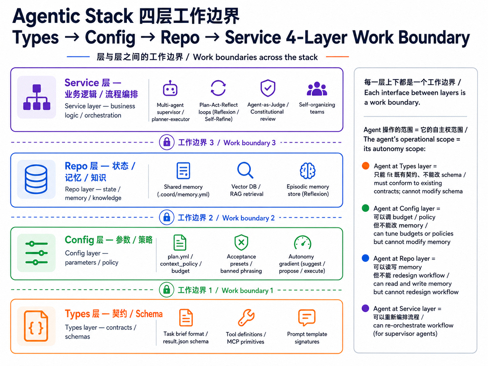
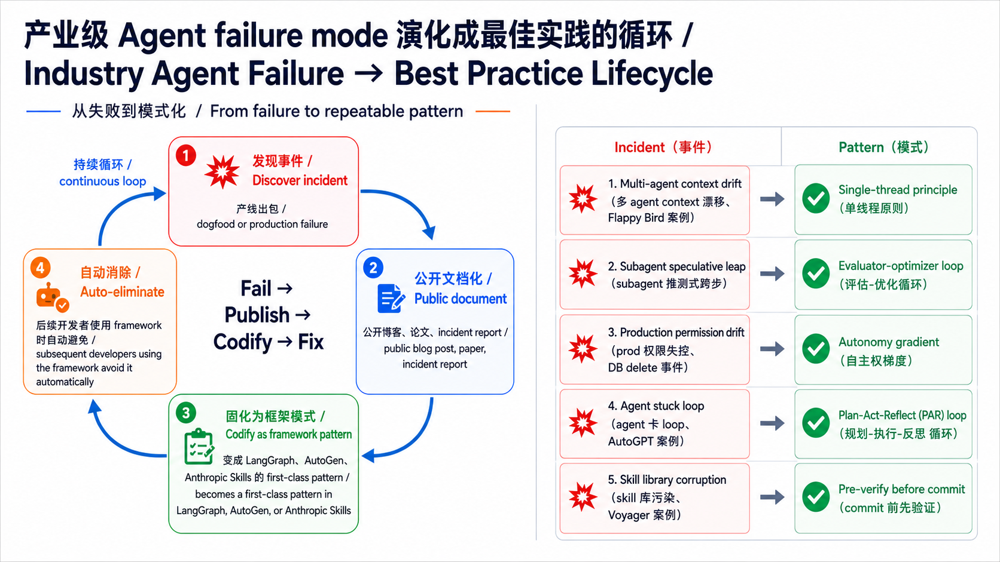
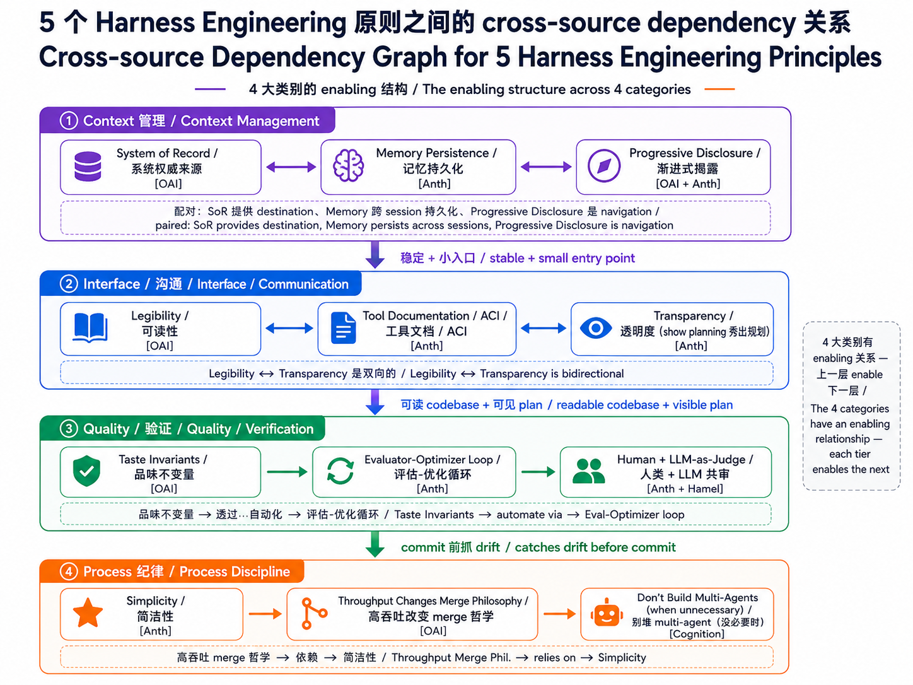

# Stage 7.5 — 进阶 Agentic Workflow 概念地图（Advanced Agentic Concepts Map，骨干 + reading path）

> [繁體中文](./07.5-advanced-agentic-concepts.md) | **简体中文** | [English](./07.5-advanced-agentic-concepts.en.md)

⏱ **时间估算**：1 周（约 5 小时——不写 code、只读资源建立概念地图）

> 💡 这是一份 **进阶概念地图 + reading path**，不是完整教学。Stage 4 / 6 / 7 学完后已经能做能上线给人用的 **agent**（AI 自主执行体、自己会规划 + 执行任务的 LLM 系统、俗称 production agent）；本 stage 帮你定位**业界还在讨论哪些进阶概念存在**、**每个概念解什么问题**、**该先读哪些 paper / blog**，避免你在真实工作里踩到别人已经踩过的坑。

> 📋 **本章组成**：为什么有这 stage → **概念地图主轴：Types → Config → Repo → Service 四层工作边界**（diagram）→ 12 个进阶概念 skeleton → 为什么选这 12 个 → **跨概念 Harness Engineering 原则（多 source、4 大类别 + 关系图）** → 进阶 agentic 应用流程（5 step）→ 完整 reading path → 自我检查

## 🎯 为什么有这 stage

Stage 4 教你挑 **framework**（agent 用哪个工具写、像 LangGraph / AutoGen 那种）、Stage 6 教 **context engineering**（怎么动态管理塞给 agent 的资料：memory、retrieval、prompt 组装）、Stage 7 教 **harness engineering**（agent 周围的可靠运作环境：observability / retry / cost gate / eval / sandbox 等 8 个元件、Stage 7 会逐个介绍）——这 3 个 stage 加起来足以做 **70% 的 production-grade agent**（能给真人用、不会三天两头出包）。

但前线的 AI lab（Anthropic / OpenAI / Cognition / Microsoft）+ 学术界（Stanford / CMU / Princeton）在 2024-2026 持续推出 12+ 个进阶设计概念。**有些现在你用不到、但需要知道它们存在**——这样以后遇到问题时、才知道有现成的 pattern 可以套。本 stage 不是再教一套理论、而是给你一张**地图**：

- 不是要你全部学会
- 不是要你全部都用
- 是让你**遇到问题时、知道该翻哪篇 paper / blog 找答案**
- 是让你**看别人写的 agent 时、看得出它在做什么**——举例：别人的 agent 一出错就“重试 N 次直到放弃”（=只有 retry）、跟它“出错后先想一轮、修正方法再试”（即所谓 plan-act-reflect loop）、是完全不同等级的设计。能看出差别、你才知道该不该借用对方的做法
- 是让你**知道每个概念该套到 agent 系统哪个部分、解哪一类问题**

## 🧭 概念地图主轴：四层工作边界（work boundary）

本 stage 用**工作边界**作为整理进阶 agentic workflow 的主轴：把 agent 系统拆成 4 个层级（**Types → Config → Repo → Service**、下面马上展开）、然后问“agent 动的对象属于哪一层？跨层越界会出什么问题？”这不是把整章缩成一个模型、而是先给读者一个定位坐标、后面 12 个概念才能放到同一张图上比较。

> 💡 **“stack”是什么意思**：软件工程习惯把系统拆成上下层、每层各管一件事、上层盖在下层之上、合称 stack（堆叠）。例如 web 应用常见“frontend → backend → database”三层 stack。本 stage 把 agent 系统也拆成 4 层（Types / Config / Repo / Service）、看 agent 该动到哪一层。

> ⚠️ **这套 4 层跟 Stage 7 的 prompt → context → harness 三层不一样，是两种不同视角**：
> - **Prompt → Context → Harness**（Stage 7）：**stack 位置**——你正在工程“字符串 / 信息 / 外围 runtime”的哪一个对象？
> - **Types → Config → Repo → Service**（本 stage）：**自主权范围**——agent 能动到 stack 多深？跨层越界算不算违规？
>
> 两者**正交**，解决的是不同问题。读完本节后，你应该能同时用两种视角看 agent 系统。

借用软件架构里的 **Types → Config → Repo → Service** 分层，套到 agent 系统：



→ 每一层上下都是一个**工作边界**。agent 操作的范围 = 它的自主权范围：

- **Agent at Types layer** = 只能符合既有 contract（契约），不能改 schema（例：Codex 接到 brief 后，只能加 inline gloss）
- **Agent at Config layer** = 可以调 budget / policy，但不能改 memory（例：context-budget agent 改 `max_cost_usd`）
- **Agent at Repo layer** = 可以读写 memory / vector store，但不能 redesign workflow
- **Agent at Service layer** = 可以重组整个 workflow，拥有最高自主权

### 为什么工作边界适合当主轴

很多进阶概念最后都会回到同一个问题：agent 的自主权到底到哪里为止？把 agent 当作新进实习生来想：你交代一个明确的小任务、他却自作主张把邻近的东西也动了——这就叫“跨工作边界”。业界已有 3 个公开记录的真实案例可以对应：

- **越界没收手**（Cognition 的 Flappy Bird 案例）：用 **multi-agent**（多个 agent 并行协作）拆解任务、其中一个 **subagent**（主 agent 派出的子 agent、执行某个子任务）负责画绿色管道、另一个负责画云朵背景，结果合起来双方风格完全对不上——因为每个 subagent 只看到自己那块、没有对方在做什么的 **context**（上下文、agent 拿到的全部资料）。Cognition 直白写道：“sub-agent 像一群过度自信的新人、根本不会在该问的时候问问题”。
  → 出处：[Cognition — Don't Build Multi-Agents (2025-06)](https://cognition.ai/blog/dont-build-multi-agents)

- **加料**（Anthropic Multi-Agent Research 的 speculative-leap 现象）：subagent 被指派“研究某主题”、它在报告里擅自加上“我推测 X 也可能成立、虽然我没验证”这类没人要的推论。Anthropic 在他们的 multi-agent 论文里专门讲为什么这种“主动补完”要通过工程设计消除、否则 hallucination 会在 supervisor 没注意时偷渡进结果。
  → 出处：[Anthropic — How we built our multi-agent research system (2025-06)](https://www.anthropic.com/engineering/built-multi-agent-research-system)

- **operator 给太多权限**（Replit Agent 2024 prod database 事故）：据社群讨论，有使用者把 production database access 直接交给 agent、没设“破坏性操作要先 confirm”的 gate，结果 agent 在“修 bug”过程跑了破坏性 SQL、清掉 production 数据。错不在 agent 看起来合理地照指令做、错在 operator 没设边界。
  → 出处：[Simon Willison 对此事故的分析（2024）](https://simonwillison.net/2024/Aug/26/replit/)（社群整理、非 Replit 官方 postmortem）

**这 3 个案例告诉你的事**：

- agent 不会“刚好停在你交代的那个点”——brief 要明确写“**只能动 X、绝对不要动 Y**”、subagent 要明确收到 parent 的 full context
- agent 会主动“补完”没被要求的东西——要靠 structured output schema + evaluator-optimizer loop 把这类 speculative 内容过滤掉
- 规则“装好了 ≠ 会被遵守”——operator 自律不够、必须有 mechanical gate（permission check / cost cap / destructive op confirm）才挡得住

→ **实作对照**：work boundary 写进 brief（Anthropic 的 brief template、LangGraph 的 state schema、`agent-collab-skills` 的 task-splitter 都是同一概念）+ enforce 在 acceptance gate / evaluator loop + 破坏性操作加 explicit gate（[autonomy gradient](#7-autonomy-gradients--trust-layers) 那节展开）。

### 🔁 Failure-mode lifecycle（产业级 agent 失败模式怎么演化成最佳实践）



每个产业级 agent failure mode 都走过 **发现 incident → 公开文档化 → encode 成 framework pattern → 自动消除** 的循环。5 个有公开记录的案例：

| # | Incident（发现）| 文档化（命名）| Codify（变成什么 pattern）| 公开出处 |
|---|---|---|---|---|
| 1 | Multi-agent subagent context drift（Flappy Bird 风格分裂）| "Sub-agents don't share principal-agent context" | **Single-thread principle**: 别堆 multi-agent、用 linear orchestration | Cognition 2025-06 |
| 2 | Subagent speculative leap（没验证的推论偷渡进结果）| "Speculative hallucination via filling-in" | **Evaluator-optimizer loop**: 加 critique step 强制 review | Anthropic Multi-Agent Research 2025-06 |
| 3 | Production permission drift（agent 砍 prod DB）| "Unbounded autonomy on destructive ops" | **Autonomy gradient**: suggest / propose / execute 三段授权 | Replit Agent 2024 incident |
| 4 | Agent looping without self-criticism（AutoGPT 卡 loop）| "Reflexion-less iteration" | **Plan-Act-Reflect loop**: 加 self-critique + revise | Reflexion paper (Shinn 2023) |
| 5 | Skill library corruption（broken skill 进 library）| "Untested skill commit" | **Pre-verify before commit**: skill 入 library 前必跑 test | Voyager paper (Wang 2024) |

→ **这套“fail → publish → codify → fix”循环是整个 agentic 领域的进化机制**——不是“一开始就写死所有规则”、而是“**每个 production incident 都被公开 + codify 成 pattern**”。Anthropic Skills 的 `references/` 机制、OpenAI 的 Taste Invariants、LangChain 的 evaluator pattern、Anthropic 的 evaluator-optimizer——都是同一逻辑的不同实作。

→ **怎么用这张表学**：遇到自己 agent 出包时、查上表“最像哪一行”、然后读对应 pattern 名（Single-thread / Evaluator-optimizer / Autonomy gradient / PAR / Pre-verify）的 deep dive。本 stage 后面 12 个 skeleton 涵盖全部 5 个 pattern。

## 📚 12 个进阶概念 — skeleton

每个概念控制在 4 行以内：一句话定义 + agent 动到哪一层 + 最值得读的 1 个资源。

### 🗺️ 12 概念 cluster map（动到哪一层 × 解什么类型的问题）


上图把 12 个概念按 **“动到哪一层”**（横轴）和 **“解决什么类型的问题”**（纵轴）分群、让你一眼看出哪些概念适合一起学、哪些可以暂时跳过。其中 **Work Boundary（#1）跨所有层**（属于通用纪律、不是某个特定位置）。

→ **怎么用这张 map**：
- **第一次学**：先学“**编排类 + 反思类**”（共 6 个，是 multi-agent / production 的基础）
- **要 deploy production**：补“**治理类 + 韧性类**”（共 6 个，防止上线出包）
- **跨类别主轴**：**Work Boundary（#1）是贯穿全部 12 个概念的 root discipline**

下面 12 个概念用表格列出（# / 概念 / 动到哪一层 / 一句话定义 / 最佳读物）：

| # | 概念 | 动到哪一层 | 一句话定义 | 最佳读物 |
|---|---|---|---|---|
| 1 | **Work Boundary / Scope Discipline** | 跨所有层（discipline）| agent 只动 brief 指定的对象、不越界 | [Hamel — Evals + Skills](https://hamel.dev/blog/posts/evals-skills/) + [Cognition — Don't Build Multi-Agents](https://cognition.ai/blog/dont-build-multi-agents) |
| 2 | **Contract-driven Hand-offs** | Types + Service | 上游 agent 承诺的 artifacts、下游 agent 必须验证自己真的收到了 | [Anthropic — Building Effective Agents](https://www.anthropic.com/engineering/building-effective-agents) Routing pattern |
| 3 | **Speculative / Parallel Exploration** | Service（编排）| 跑 N 条 alternative 路径、最后取最佳那条（不只是独立 parallel）| [LangGraph Plan-Execute Tutorial](https://blog.langchain.com/planning-agents/) |
| 4 | **Agent-as-Judge / Constitutional AI** | Service（agent 评 agent）| 用一个 agent 评另一个 agent 的输出、并按明确原则反复修正 | [Constitutional AI (Bai 2022)](https://arxiv.org/abs/2212.08073) |
| 5 | **Plan-Act-Reflect Loop** | Service（单 agent 自我循环）| write plan → execute → critique → revise → re-execute、直到 PASS 或 EXHAUSTED | [Reflexion (Shinn 2023)](https://arxiv.org/abs/2303.11366) + [Self-Discover (Zhou ICML 2024)](https://arxiv.org/abs/2402.03620) |
| 6 | **Hierarchical Task Decomposition** | Service（多层 supervisor）| supervisor → worker → sub-worker、至少 2 层 recursion | [Microsoft AutoGen GroupChat docs](https://microsoft.github.io/autogen/) |
| 7 | **Autonomy Gradients / Trust Layers** | Config（autonomy policy）| 不同任务给不同自主权（suggest / propose / execute）| [Claude Code permission system](https://docs.claude.com/en/docs/agents-and-tools/claude-code/overview) |
| 8 | **Cost-aware Budget Gates** | Config（cost policy）| 超过 \$ 预算就自动停或升级审核（不只是 token 上限）| [OpenAI Harness Engineering (2026-02)](https://openai.com/index/harness-engineering) |
| 9 | **Failure Injection / Chaos Eval** | Service（测试 agent 容错）| 故意给 broken input / stale data / API timeout、看 agent 怎么处理 | [Hamel Husain — Evals blog series](https://hamel.dev/blog/posts/evals/) |
| 10 | **Self-organizing Teams** | Service（agent 动态协商 role）| agents 不是预先分配 role、而是根据任务动态分工 | [CAMEL (Li 2023)](https://arxiv.org/abs/2303.17760) + AutoGen |
| 11 | **Spec-driven Development** | Types（spec = code）| agent task 由 formal spec（YAML / JSON Schema）定义、不是自由 prompt | [DSPy](https://github.com/stanfordnlp/dspy) signatures tutorial |
| 12 | **Graceful Degradation Paths** | Config（fallback policy）| frontier model 挂掉时、回退到便宜 model 并降低预期、而不是直接 crash | [OpenRouter routing docs](https://openrouter.ai/docs) + [Anthropic model fallback](https://docs.claude.com/en/docs/build-with-claude/models) |

## 为什么选这 12 个

- 都有可验证的 primary source（Anthropic / OpenAI / Cognition / Microsoft / academic paper），不是空谈
- 都对应到至少一个公开实作（LangGraph / AutoGen / Anthropic Skills / DSPy 等）、可以直接拿来抄
- 都在 Stage 4 / 6 / 7 已覆盖范围之外，没有重复
- 避免“无限延伸”——其他进阶概念（Voyager skill learning / MemoryLLM / world models）很重要，但**先把这 12 个学完**

## 🔬 跨概念 Harness Engineering 原则（多 source 整理）

**这些原则不是任何单一厂商独有的**。Anthropic、OpenAI、Cognition、Hamel Husain 等都在各自的文章 / blog / docs 中谈过，只是用词不同，但指向的是同一组设计约束。下面先把**原则整理成 4 大类别**、列出主要来源，再往下展开细节。

> 📚 主要 source：
> - **Anthropic**（Building Effective Agents · Skills · Multi-Agent Research · CLAUDE.md memory docs）
> - **OpenAI**（[Harness Engineering 2026-02](https://openai.com/index/harness-engineering/)，把它们清楚整理成 5 条命名原则）
> - **Cognition AI**（[Don't Build Multi-Agents](https://cognition.ai/blog/dont-build-multi-agents)）
> - **Hamel Husain**（[Evals are everything](https://hamel.dev/blog/posts/evals/)）
> - **Lilian Weng**（[LLM Powered Autonomous Agents](https://lilianweng.github.io/posts/2023-06-23-agent/)）

### 4 大类别 × 多 source

| 类别 | 核心问题 | 该类别下的原则（含 source） |
|---|---|---|
| **① Context 管理** | 上下文不爆炸，agent 永远拿到对的信息 | **System of Record** [OAI] / **Memory Persistence** [Anth] / **Progressive Disclosure** [OAI + Anth] |
| **② Interface / 沟通** | agent 看得懂 codebase，也能说清楚自己在做什么 | **Legibility** [OAI] / **ACI / Tool Documentation** [Anth] / **Transparency**（show planning）[Anth] |
| **③ Quality / 验证** | 写得对，不能 hallucinate | **Taste Invariants** [OAI] / **Evaluator-Optimizer loop** [Anth] / **Human + LLM-as-Judge** [Anth] / **"Evals are everything"** [Hamel] |
| **④ Process 纪律** | scale + iterate 不爆 | **Simplicity** [Anth] / **Throughput Changes Merge Philosophy** [OAI] / **Don't Build Multi-Agents (when unnecessary)** [Cognition] |

→ **OpenAI 那 5 条原则**是“命名最清楚 + case study 最完整”的整理版本。但类别 ① 的 SoR / Memory Persistence、类别 ② 的 ACI、类别 ③ 的 Eval-Optimizer、类别 ④ 的 Simplicity，其实都先由 Anthropic 等其他来源讲过。下面会继续用 OpenAI 的命名往下展开，因为它们写得最完整，同时在每节标出对应的 Anthropic 等 source。

### 原则之间的主要关系（cross-category dependencies）

它们不是 5 条互不相关的原则，也不是 12 个彼此孤立的概念。它们之间有明显的 **enabling 关系**：



→ **4 个关系 insight**：
- **SoR + Memory Persistence + Progressive Disclosure 是成套的**：SoR 提供 destination，Memory 负责跨 session 持久化，Progressive Disclosure 是导航机制。少任何一个都不完整。
- **Legibility ↔ Transparency 是双向的**：agent 看得懂 codebase，才能 self-report；agent 会 self-report，你才验证得了 legibility 是否真的有效。
- **Quality 类别是 ④ 自动化的前置条件**：如果 invariants 没写死、eval loop 没建好，人类就不可能放心把 review 交给 automation。
- **Simplicity 是隐性的 root**：一上来就堆 multi-agent，其他所有原则的复杂度都会暴涨。Cognition 的 “Don't Build Multi-Agents” 和 Anthropic 的 “Simplicity” 本质上在讲同一件事。

→ 下面 5 节继续用 OpenAI 的命名版本展开（因为最完整），同时回头标 cross-source mapping。

### 为什么要在意这些原则 — Why → What → How

下表以“**痛点（Why）→ 原则（What）→ 实作（How）**”三层解释这些原则在解什么问题、用什么工具落地：

| 痛点（Why）| 原则（What）| 实作（How）|
|---|---|---|
| Context 200k 满 / Multi-agent context overflow | Progressive Disclosure + Memory Persistence | Skills `references/` / `CLAUDE.md` `@-import` / `.ai/<task>` brief |
| Agent 看不懂自家 codebase | Legibility + Tool Doc / ACI | `AGENTS.md` 100 行 / poka-yoke 工具设计 / 一致 schema 命名 |
| 多 agent desync、不同事实版本 | System of Record | `docs/` + `.coord/` shared-memory skill |
| 随机 drift / Review 漏抓 | Taste Invariants + Transparency（planning 显示）| `agent-acceptance-gate` preset YAMLs / evaluator-optimizer loop |
| Agent 写 PR 快、Human QA 跟不上 | Throughput Changes Merge Philosophy | mandatory preset / LLM-as-judge / Human spot-check |
| 一上来就堆 multi-agent overkill | Simplicity（Anthropic）| 先 basic LLM call、确认需要才加 agent |

→ **6 个痛点 → 5 + 3 个原则**（OpenAI 5 + Anthropic 3 extra）→ **8+ 个具体工具 / 机制**。

### 5 个 OpenAI 原则速查表

下面 5 节各自展开原则细节（含 OpenAI 原文 quote）；先给速查表：

| # | 原则 | 一句话 | 跨 work boundary | 对应 tool |
|---|---|---|---|---|
| 1 | **Legibility** | 把 agent 当新进工程师、为它优化 navigability（不是让人读懂 agent）| Repo + Types | Skill `references/` + AGENTS.md / CLAUDE.md pattern |
| 2 | **System of Record** | 知识住 `docs/`、不住 prompt；100 行 entry map 指向深处 | Repo | `.coord/memory.yml` shared-memory + AGENTS.md / CLAUDE.md |
| 3 | **Progressive Disclosure** | 小 entry point + 教 agent 之后去哪查（跟 SoR 配对：SoR 提供 destination、PD 是 navigation）| Repo + Types | Skill `references/` 机制 + Codex `.ai/<task>.md` brief |
| 4 | **Architecture & Taste Invariants** | 定义边界、不细管实作；lint 强制 schema / 命名 / 文件大小 | Config + cross-cutting | `agent-acceptance-gate` preset YAML、custom linter |
| 5 | **Throughput Changes Merge Philosophy** | agent PR 速度 > 人类 QA 速度 → QA 必须自动化、不依赖逐行读 | Service（merge workflow）| 自动 lint + test + acceptance gate、mandatory preset |

→ 下面 5 节展开每个原则本身、最后 Anthropic ↔ OpenAI 对照 列出两家对照词 + 推荐读本。

### 1. Legibility — 让 agent 能读懂 codebase / docs

> "Because the repository is entirely agent-generated, it's optimized first for **Codex's legibility**." — OpenAI

方向跟“让人读懂 agent 输出”相反——把 agent 当新进工程师、为它优化 navigability。

- **怎么做**：consistent schema 命名、文件大小限制（不让 agent 一次读爆）、`docs/` hierarchical 结构让 agent 能 traverse
- **跨 work boundary**：Repo + Types
- **对应 tool**：Claude Code Skill 的 `references/` 机制 + AGENTS.md / CLAUDE.md pattern

### 2. System of Record — 知识住 docs、不住 prompt

> "The repository's knowledge base lives in a structured `docs/` directory **treated as the system of record**. A short `AGENTS.md` (roughly 100 lines) is injected into context and serves primarily as a map." — OpenAI

唯一权威来源、agent 从这里读写、不要把 context 塞 system prompt。

- **怎么做**：100 行 entry map（AGENTS.md / CLAUDE.md）指向 `docs/` 深处、不在 prompt 中重复内容
- **跨 work boundary**：Repo
- **对应 tool**：`.coord/memory.yml`（[agent-shared-memory](https://github.com/WenyuChiou/agent-collab-skills) skill）+ AGENTS.md / CLAUDE.md pattern

### 3. Progressive Disclosure — 从 small entry point 往深挖

> "Agents start with a small, stable entry point and **are taught where to look next**, rather than being overwhelmed up front." — OpenAI

跟 #2 SoR 一起运作：SoR 提供 destination、Progressive Disclosure 是怎么导航。

- **怎么做**：AGENTS.md 100 行 + 指向 `docs/subsystem-X.md`（agent 需要才读深处）
- **跨 work boundary**：Repo + Types
- **对应 tool**：Claude Code Skill 的 `references/` 机制（只在 agent 需要才 load）+ Codex `.ai/<task>.md` brief pattern（先读 brief 再决定深挖）

### 4. Architecture & Taste Invariants — 用 lint 强制不变量

> "We enforce these rules with custom linters and structural tests, plus a small set of **'taste invariants.'** ... **By enforcing invariants, not micromanaging implementations**, we let agents ship fast." — OpenAI

AI 写 code 时倾向「怎么快怎么来」、常导致模块过度耦合、命名混乱、文件爆炸。OpenAI 团队用**强制性结构规则**约束 AI、让 agent 在你划好的边界内快跑、而不是每行都要人盯：

**(a) Enforcing Architecture — 用「物理边界」框住 AI**

像在盖房子前先搭好钢筋支架、AI 只能在格子里填肉：

- **单向依赖（One-way Dependency）**：定义严格的层级、底层的 Types 绝对不能引用高层的 Service。AI 想偷渡 import 会被挡。
- **刚性目录结构**：规定特定的 code 必须待在特定目录（如 `models/` / `controllers/` / `schemas/`）、AI 不能自己乱建 folder。
- **自动化 Linter**：如果 AI 写出违规 code（例如在数据层直接调用 API）、CI 自动拒绝 merge、逼 AI 重写。

**(b) Enforcing Taste — 把「工程美学」变成规则**

「品味」听起来主观、但工程上指的是**可维护性、一致性、简洁度**。AI 没有美感、它只会根据概率产出结果——所以要把美感写成 lint 规则：

- **黄金准则 list**：写下「**偏好 composition 而非 inheritance**」、「**函数必须短小**」、「**文件 < 500 行**」这类原则、变成 invariant。
- **代码风格统一**：harness 强制 AI 产出的命名、逻辑组织看起来像「同一个高阶工程师写的」、而不是混杂风格的大杂烩。
- **拒绝「AI slop」**：AI 常生成冗余、无用但「看起来正确」的 code。设定「品味基准」要求 AI 不断重构、简化、直到达到人类专家认可的优雅程度。

→ **核心精神**：**定义边界、不细管实作**——让 agent 在你划好的格子里自由冲、而不是每行都要人盯。

- **跨 work boundary**：Config + cross-cutting（lint 规则写在 Config、强制检查跨所有层）
- **对应 tool**：`agent-acceptance-gate` YAML preset（`multi-locale-mirror-sync.yml` / `catalog-entry-add.yml` / `fact-check-frontier-models.yml`）——预先 codify「跑出来该长什么样」

### 5. Throughput Changes Merge Philosophy — agent 高吞吐 → 人类 QA 变瓶颈

> "...3.5 PRs per engineer per day... **the bottleneck became human QA capacity**." — OpenAI

agent 写 code 变快了、人类 review 跟不上、必须把 QA 自动化 / 让 agent 自我验证。

- **怎么做**：自动 lint + 自动 test + 自动 acceptance gate；commit 前不依赖人逐行读
- **跨 work boundary**：Service（merge workflow）
- **对应 tool**：`agent-acceptance-gate` 整套、特别是 mandatory preset 机制（trigger fire → preset 必跑）

### 5 原则 × Stage 7 Harness 8 元件对照表

下表展示 5 个原则怎么作用到 [Stage 7 Harness Engineering 的 8 个核心元件](07-multi-agent-production.zh-Hans.md#harness-的-8-个核心元件)上（✓ = applies、✓★ = primary lever）：

| 原则 ＼ Harness 元件 | 1. Agent Loop | 2. Tool Reg | 3. Ctx Mgr | 4. Retry | 5. Sandbox | 6. Obs | 7. Eval | 8. Cost / Lat |
|---|:---:|:---:|:---:|:---:|:---:|:---:|:---:|:---:|
| **1. Legibility** |  | ✓ | ✓ |  |  | ✓ |  |  |
| **2. SoR** |  |  | ✓★ |  |  | ✓ |  |  |
| **3. Progr. Disc.** | ✓ |  | ✓★ |  |  |  |  | ✓ |
| **4. Invariants** |  | ✓ |  | ✓ | ✓ |  | ✓★ |  |
| **5. Merge Phil.** |  |  |  |  |  |  | ✓★ | ✓ |

→ **Context Manager（#3）+ Eval（#7）是被 4-5 个原则同时作用的热点**——这也是 v0.2.3 preset / `agent-acceptance-gate` / `agent-shared-memory` 都围着这两个元件设计的原因。

→ **Tool Registry（#2）+ Observability（#6）次热**——被 3 个原则影响、Legibility 把 schema 写对 + Invariants 把 lint 写对 + SoR 把记录写对。

→ **Retry / Sandbox / Cost-Latency** 只被 1-2 个原则作用——这几个元件相对“机械”、原则上对应 1 个 lever 就够。

### 📚 Anthropic ↔ OpenAI cross-vendor 对照 + 推荐读本

OpenAI 那 5 原则 Anthropic 大部分也都讨论过、用的词不同。下表是 cross-vendor 对照、每个都附 canonical URL：

| OpenAI 原则 | Anthropic 对应词 / pattern | 最权威 URL |
|---|---|---|
| **1. Legibility** | ACI（Agent-Computer Interface）+ Tool Documentation | [Building Effective Agents Appendix](https://www.anthropic.com/engineering/building-effective-agents) |
| **2. System of Record** | CLAUDE.md hierarchy + Memory persistence | [Claude Code: How Claude remembers your project](https://code.claude.com/docs/en/memory) + [Multi-Agent Research System](https://www.anthropic.com/engineering/built-multi-agent-research-system) |
| **3. Progressive Disclosure** | **同词**（Anthropic Skills 自己也用“core design principle”描述）| [Equipping Agents for the Real World with Agent Skills](https://www.anthropic.com/engineering/equipping-agents-for-the-real-world-with-agent-skills) ⭐⭐⭐ |
| **4. Taste Invariants** | Evaluator-optimizer loops + Tool "poka-yoke"（如强制 absolute filepath）| [Building Effective Agents Evaluator-optimizer](https://www.anthropic.com/engineering/building-effective-agents) |
| **5. Throughput Changes Merge Philosophy** | "Human evaluation catches what automation misses" + LLM-as-judge 并用 | [Multi-Agent Research System Evaluation challenges](https://www.anthropic.com/engineering/built-multi-agent-research-system) |

**Anthropic 额外强调的 3 个 OpenAI 没重点讲的原则**：

| 原则 | 白话 | URL |
|---|---|---|
| **Simplicity** | 先用 basic LLM call、不要跳 multi-step agent | [Building Effective Agents Simplicity](https://www.anthropic.com/engineering/building-effective-agents) |
| **Transparency** | "explicitly showing the agent's planning steps"——agent 自己秀 plan | [Building Effective Agents](https://www.anthropic.com/engineering/building-effective-agents) |
| **Memory persistence** | context 满前先存外部、subagent 用 fresh context 接力 | [Multi-Agent Research System](https://www.anthropic.com/engineering/built-multi-agent-research-system) |

#### 推荐阅读顺序（45 + 20 min）

**先读这 3 篇（总计 ~45 min）**：

1. [Anthropic — Building Effective Agents](https://www.anthropic.com/engineering/building-effective-agents) ⭐⭐⭐ — 涵盖原则 #1 + #4 + Simplicity / Transparency、**最基础、先读**
2. [Anthropic Engineering — Equipping Agents for the Real World with Agent Skills](https://www.anthropic.com/engineering/equipping-agents-for-the-real-world-with-agent-skills) ⭐⭐⭐ — 涵盖原则 #3、Anthropic 直接用 "progressive disclosure" 词、3-tier loading 完整解说
3. [Claude Code — How Claude remembers your project](https://code.claude.com/docs/en/memory) ⭐⭐ — 涵盖原则 #2、CLAUDE.md 4-tier hierarchy + `@-import` + AGENTS.md 互通

**再读这 1 篇（~20 min）**：

4. [Anthropic — How we built our multi-agent research system](https://www.anthropic.com/engineering/built-multi-agent-research-system) — 补 #2 + #5 + Memory persistence production 案例

**OpenAI 原始文章**：

5. [OpenAI — Harness Engineering](https://openai.com/index/harness-engineering/) — Codex 自身 case study、5 原则的源头

### 📋 概念验证 prompt（self-quiz）

> 🛠️ **想直接动手写 SKILL.md / CLAUDE.md？** 4 个实作用 prompt（audit 既有 / 生成新的）已经**移到 [Stage 5](05-claude-code-ecosystem.zh-Hans.md)**，那边才是读者真正开始动手写的地方：
> - [Stage 5.1  CLAUDE.md 设计 prompts](05-claude-code-ecosystem.zh-Hans.md#-claudemd-设计-prompts依-5-原则)
> - [Stage 5.3  SKILL.md 设计 prompts](05-claude-code-ecosystem.zh-Hans.md#-skillmd-设计-prompts含-skill-creator-替代)

本节只保留 **1 个 quiz prompt，帮你确认自己是否真的理解这 5 条原则**，属于不写 code 的概念检查。

#### Prompt 1 — Self-quiz（考自己懂不懂这 5 条原则）

```
我刚学完 OpenAI 5 个 harness engineering 原则：
1. Legibility
2. System of Record
3. Progressive Disclosure
4. Taste Invariants
5. Throughput Changes Merge Philosophy

请出 5 道情境题、每题描述一个真实的 SKILL.md / CLAUDE.md 设计决定（例如“我把所有 examples 都塞 SKILL.md 主档、< 1000 行”），问**违反哪一条原则 + 该怎么修**。

一次出 1 题、等我回答后给反馈、再出下一题。最后给总成绩。
```

→ **建议用法**：学完上面 5 条原则后跑这个 quiz，确认你真的抓到 concept；真正写 SKILL.md / CLAUDE.md 的 prompt，请回到 [Stage 5](05-claude-code-ecosystem.zh-Hans.md)。

### 📐 进阶 agentic 概念应用流程（读者导引）

学完前面 5 条原则 + Anthropic 对照后，**怎么把这些概念真的用到 agent 设计上？** 从 Stage 7（你已经能做 production agent）往下、5 个步骤到 production：

1. **建立概念地图主轴 — 四层工作边界**：Types → Config → Repo → Service。想清楚 agent 能动到 stack 哪一层、跨层算违规。
   → 本 stage §概念地图主轴：四层工作边界

2. **挑 2-3 个相关进阶概念**：从 12 个 skeleton 找跟你问题最相关的（Work Boundary / Contract / PAR / Autonomy 等）。
   → 本 stage §12 个进阶概念（pattern 清单）

3. **套 5 个 OpenAI 原则（cross-cutting）**：Legibility / SoR / Progressive Disclosure / Taste Invariants / Throughput Merge Philosophy。这 5 条原则跨越全部 12 个概念、决定“做得对不对”。
   → 本 stage §跨概念 Harness Engineering 原则

4. **Encode 到 Skills + CLAUDE.md**：用 Stage 5 的 4 个 prompt 动手写——CLAUDE.md audit / generate（[Stage 5.1](05-claude-code-ecosystem.zh-Hans.md#51--claude-code-基础)）+ SKILL.md audit / generate（[Stage 5.3](05-claude-code-ecosystem.zh-Hans.md#53--skillsclaude-code-的行为层-claude-code-生态最关键的一层)）。

5. **Verify with acceptance gate**：Preset YAML 抓 drift / LLM-as-judge 自动评 / Human spot-check 补 edge case。
   → [agent-collab-skills](https://github.com/WenyuChiou/agent-collab-skills)

→ **Production agent ready**：可稳定给人用、有自动验证、有可预测失败。

→ **怎么用这 5 步**：第一次读本 stage 时、按 1 → 5 顺序走；之后实作 agent 卡住时、再回来判断自己卡在了哪一步。

→ **它和前面 Why → What → How 表的区别**：那张是“**痛点 ↔ 原则 ↔ 工具**”的横向对照、适合当 reference；这 5 步是“**从学完到上线**”的纵向流程、适合照着一步一步做。

## 📖 完整 reading path（按 depth 分层）

按深度排序，不必全读。Foundation tier 必读（总计约 95 分钟），其他内容则是**遇到真实问题时再深挖**：

### 🌳 Reading decision tree（按你卡的问题选读）


这不是普通 reading list、而是 **decision tree**。你现在卡在哪个问题、就先读对应的那 1-2 篇（上图 5 个分支对应 5 种卡关状况；下面是每个分支读完第 1 篇后的进阶推荐）：

**分支读完后的延伸阅读**（branch-specific second readings）：

- “不知道 agent 怎么开始”→ 再读 ReAct paper + Lilian Weng "LLM Powered Autonomous Agents"
- “multi-agent 要不要用、怎么开”→ 再读 Anthropic Multi-Agent Research（case study section）
- “context 没效率”→ 再读 Anthropic Multi-Agent Research（memory section）
- “eval 怎么写 / 自动验证”→ 再读 Anthropic Multi-Agent Research（eval section）
- “想跟上 frontier 现况”→ 再读 AutoGen + ReAct paper

→ **规则**：每个分支**最多挑 2 篇深读**。读完再回来看自己还有什么问题，再决定下一篇，不要先泛读整个清单。

**Foundation tier**（先读这 4 个，总计约 95 分钟）：
- [Anthropic — Building Effective Agents](https://www.anthropic.com/engineering/building-effective-agents)
- [Cognition — Don't Build Multi-Agents](https://cognition.ai/blog/dont-build-multi-agents)
- [Anthropic — How we built our multi-agent research system](https://www.anthropic.com/engineering/built-multi-agent-research-system)
- [Lilian Weng — LLM Powered Autonomous Agents](https://lilianweng.github.io/posts/2023-06-23-agent/)

**Workflow patterns tier**：
- [LangGraph Planning Agents Tutorial](https://blog.langchain.com/planning-agents/)
- [Microsoft AutoGen docs](https://microsoft.github.io/autogen/)
- [DSPy](https://dspy.ai/learn/)

**Production / Harness tier**：
- [OpenAI Harness Engineering (2026-02)](https://openai.com/index/harness-engineering)
- [Hamel Husain Evals blog](https://hamel.dev/blog/posts/evals/)
- [Simon Willison coding agents notes](https://simonwillison.net/tags/coding-agents/)

**Frontier research papers**（挑 3-5 篇深读）：
- ReAct / Reflexion / CoALA / Self-Discover / Voyager / Constitutional AI / AutoGen

**中文 / hands-on**：
- [李宏毅 GenAI 2024 / 2025](https://speech.ee.ntu.edu.tw/~hylee/)
- [datawhalechina/hello-agents](https://github.com/datawhalechina/hello-agents)

## ✅ 自我检查

读完本 stage 后，你应该能：

- [ ] 用 **Types → Config → Repo → Service** 四层解释 Cognition Flappy Bird / Anthropic speculative-leap 为什么算 work-boundary violation
- [ ] 说出 12 个进阶概念里 5 个的“动到哪一层” + 一句话定义
- [ ] 讲得出 4 大类别核心原则（① Context 管理 / ② Interface / ③ Quality 验证 / ④ Process 纪律）各自解决什么问题，以及类别之间的 enabling 关系
- [ ] 知道下一步该翻哪篇 paper / blog，而不是先把全部都读完
- [ ] 区分 PAR loop（单 agent 自我修正）和 agent-debate（两个 agent 对峙）
- [ ] 在 brief 里明确写出 task 的 work boundary（什么 in-scope / out-of-scope）

→ 如果这些都能做到，你已经超出 Stage 7 Production 化的范围，进入 frontier agentic workflow design。**剩下的就是挑一篇最贴近你当前痛点的 paper，深读它。**
